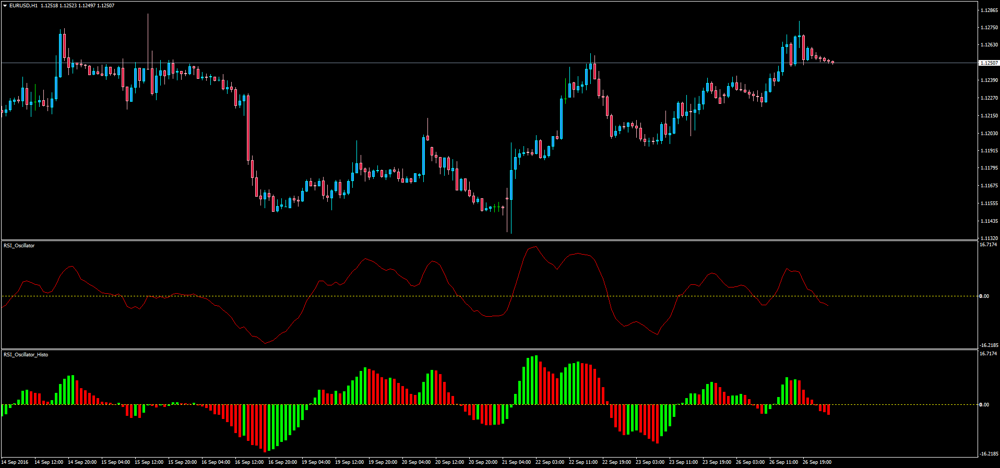

# RSI Oscillator with Histogram

> Source: https://fxcodebase.com/code/viewtopic.php?f=38&t=63909  
> Forum: 38 · Topic 63909 · 1 post(s)

---

## RSI Oscillator with Histogram

**Apprentice** · Tue Sep 27, 2016 11:28 am

LUA Original: [viewtopic.php?f=17&t=1882](https://fxcodebase.com/code/viewtopic.php?f=17&t=1882)

Description:

MT4 adaptation of an oscillator based on the following formula:

RSI OScillator = Moving Average(5) of (RSI(10) - RSI(25))

It also includes the histogram version of it.

 [RSI_Oscillator.mq4](files/108294/RSI_Oscillator.mq4)

 [RSI_Oscillator_Histo.mq4](files/108294/RSI_Oscillator_Histo.mq4)
