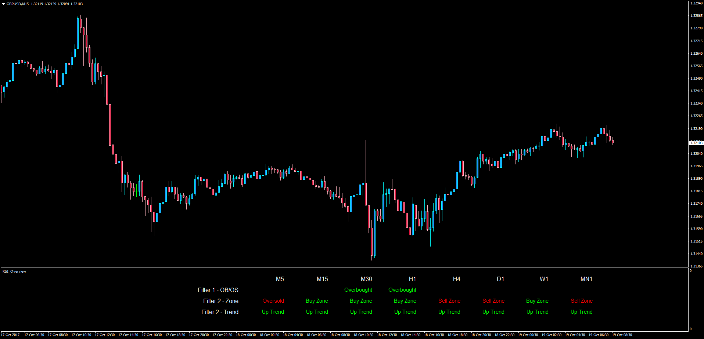

# RSI Overview

> Source: https://fxcodebase.com/code/viewtopic.php?f=38&t=65183  
> Forum: 38 · Topic 65183 · 4 post(s)

---

## RSI Overview

**Apprentice** · Thu Oct 19, 2017 2:46 am

LUA Original: [viewtopic.php?f=17&t=61356](https://fxcodebase.com/code/viewtopic.php?f=17&t=61356)

Description:

This is the MT4 version of the LUA Original RSI Overview. Will present at a glance RSI information for all time frames for Chart instrument.

1. Line/Filter
RSI > 70 - Overbought
RSI < 30 - Oversold

2. Line/Filter
RSI > 50 - Buy Zone
RSI < 50 - Sell Zone

3. Line/Filter
RSI > MVA of RSI - Up Trend
RSI < MVA of RSI - Up Trend

 [RSI_Overview.mq4](files/115480/RSI_Overview.mq4)

---

## Re: RSI Overview

**davidpuchyr** · Fri Nov 10, 2017 1:43 pm

Try to implement a few ideas from here [https://quastic.com/technical-analysis/ ... its-charm/](https://quastic.com/technical-analysis/rsi-technical-indicator-and-its-charm/) for example the bollinger bands

---

## Re: RSI Overview

**Apprentice** · Mon Nov 13, 2017 4:35 am

Your request is added to the development list under Id Number 3949

---

## Re: RSI Overview

**Apprentice** · Thu Dec 07, 2017 7:47 am

Try this version.

 [RSI_Overview.mq4](files/116407/RSI_Overview.mq4)
