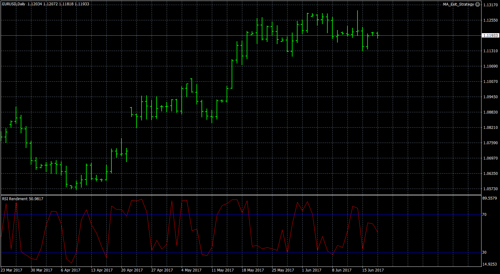

# RSI Rendiment

> Source: https://fxcodebase.com/code/viewtopic.php?f=38&t=65076  
> Forum: 38 · Topic 65076 · 1 post(s)

---

## RSI Rendiment

**Apprentice** · Mon Sep 11, 2017 4:27 pm

TS2/Lua original
[viewtopic.php?f=17&t=63612](https://fxcodebase.com/code/viewtopic.php?f=17&t=63612)

RSI Rendiment= ( (RSI) + ( Rendiment) ) / 2

Rendiment= X * natural logarithm (Close1/Close2)

close1= close of previous candelstick
close2= close of candelstick N periods ago

Normalization will shift, normalize Quantitative Return Oscillator to RSI indicator range.

 [RSI Rendiment.mq4](files/114802/RSI%20Rendiment.mq4)
