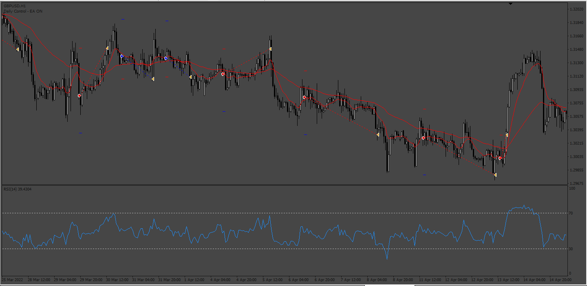
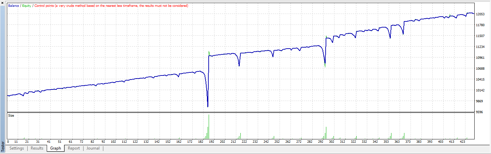
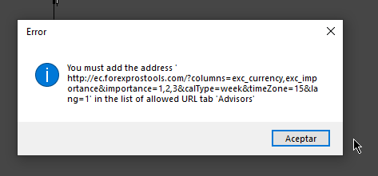
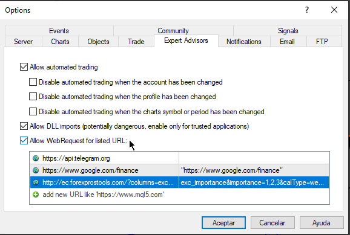
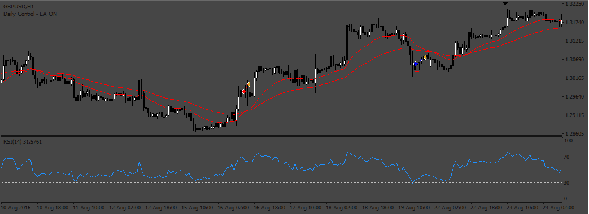

# RSI_Scalper

> Source: https://fxcodebase.com/code/viewtopic.php?f=38&t=72948  
> Forum: 38 · Topic 72948 · 10 post(s)

---

## RSI_Scalper

**Apprentice** · Mon Nov 14, 2022 5:10 pm

 

Based on the request.
[https://fxcodebase.com/code/viewtopic.php?f=38&t=72926](https://fxcodebase.com/code/viewtopic.php?f=38&t=72926)

 [RSI_Scalper.mq4](files/148341/RSI_Scalper.mq4)

---

## Re: RSI_Scalper

**swordfish304** · Mon Nov 14, 2022 8:58 pm

Thanks a lot, I would like to ask what is the best timeframe for this EA.

---

## Re: RSI_Scalper

**Stantham** · Tue Nov 15, 2022 12:27 pm

PLEASE FIX THIS EA IT DOENT OPEN ANY TRADE

---

## Re: RSI_Scalper

**vishal12** · Wed Nov 16, 2022 9:17 am

> **Apprentice wrote:**
>
>
> 726pic.png
>
>
>
>
> 726Pic2.png
>
>
> Based on the request.
> [https://fxcodebase.com/code/viewtopic.php?f=38&t=72926](https://fxcodebase.com/code/viewtopic.php?f=38&t=72926)
>
>
> RSI_Scalper.mq4

I am tring to enable news filter but cant load News
need News URL:
Please shear URL.

Thanks

---

## Re: RSI_Scalper

**Apprentice** · Thu Nov 17, 2022 4:46 am

We have added your request to the development list.
Development reference 766.

---

## Re: RSI_Scalper

**swordfish304** · Thu Nov 17, 2022 10:56 pm

Hi Apprentice,

The EA is not opening any trade, can you please check it.

Thanks a lot.

---

## Re: RSI_Scalper

**Apprentice** · Sun Nov 20, 2022 6:23 am

the EA have an alert and show the URL that need to upload the news...
anyways the URL is:

[http://ec.forexprostools.com/?columns=e ... =15&lang=1](http://ec.forexprostools.com/?columns=exc_currency,exc_importance&importance=1,2,3&calType=week&timeZone=15&lang=1)

---

## Re: RSI_Scalper

**vishal12** · Mon Nov 21, 2022 9:49 am

> **Apprentice wrote:**
>
>
> image.png
>
>
> the EA have an alert and show the URL that need to upload the news...
> anyways the URL is:
>
> [http://ec.forexprostools.com/?columns=e ... =15&lang=1](http://ec.forexprostools.com/?columns=exc_currency,exc_importance&importance=1,2,3&calType=week&timeZone=15&lang=1)

Thanks Sir

---

## Re: RSI_Scalper

**Apprentice** · Sat Jan 14, 2023 3:52 am

The file was updated.

 

News Filters
you have to turn available the web request in the platform,
go to: Tools - options - Experts Advisors tab. There be sure you have a check mark in “allow web request…” and into this grid you must to paste the URL for the news.
Example:

 

---

## Re: RSI_Scalper

**Apprentice** · Sun Apr 23, 2023 2:51 pm

Please re-download the RSI_Scalper.mq4
