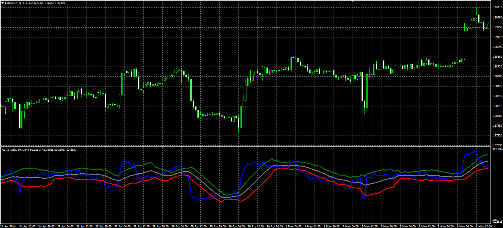

# RSI STARC oscillator

> Source: https://fxcodebase.com/code/viewtopic.php?f=38&t=60797  
> Forum: 38 · Topic 60797 · 1 post(s)

---

## RSI STARC oscillator

**Alexander.Gettinger** · Fri Jun 06, 2014 3:32 pm

Original LUA oscillator: [viewtopic.php?f=17&t=34092](https://fxcodebase.com/code/viewtopic.php?f=17&t=34092).

Formulas:
RSI = Relative Strength Index(Close price, RSI_Length),
MA = MVA(RSI, MA_Length),
Top = MA+Top_Multiplier*ATR,
Central = MA-Bottom_Multiplier*ATR, where
ATR = MVA(TR, ATR_Length),
TR[i] = Abs(RSI[i]-RSI[i-1]),
Abs - Absolute value.

 

Download:

 [RSI_STARC.mq4](files/94375/RSI_STARC.mq4)

TS2/Lua version.
[viewtopic.php?f=17&t=34092](https://fxcodebase.com/code/viewtopic.php?f=17&t=34092)
