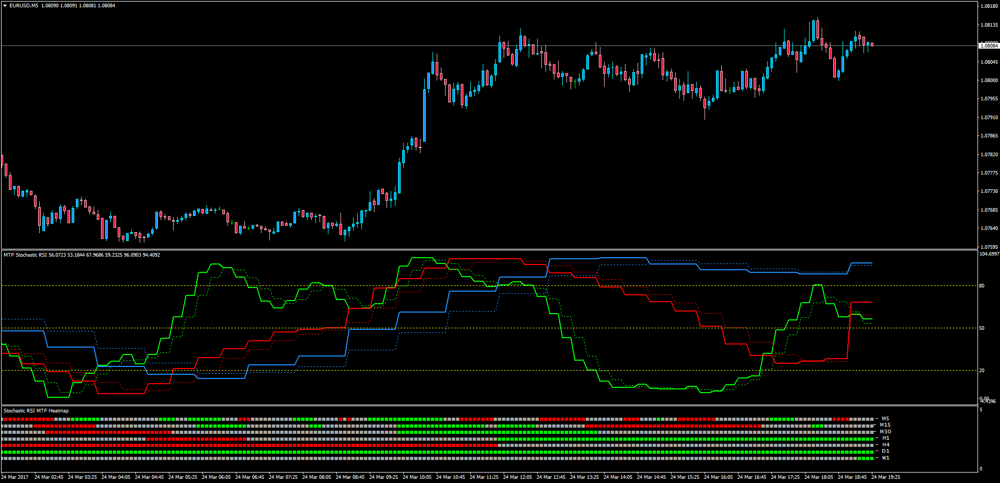

# RSI Stochastic Multi Time Frame

> Source: https://fxcodebase.com/code/viewtopic.php?f=38&t=64545  
> Forum: 38 · Topic 64545 · 1 post(s)

---

## RSI Stochastic Multi Time Frame

**Apprentice** · Sat Mar 25, 2017 7:14 am

LUA Original: [viewtopic.php?f=17&t=3008](https://fxcodebase.com/code/viewtopic.php?f=17&t=3008)

Description:

This is the LUA to MT4 version of the Multi Time Frame RSI Stochastic indicator. The trader can choose within 3 different hight TF (or current plus 2 higher ones). The oscillator will print both the K and D lines using the same color for each TF.

Heatmap

This heatmap includes de following TFs:

- M5
- M15
- M30
- H1
- H4
- D1
- W1

What the color represent?

The good part about this indicator is that the trader will choose what the colors represent among the following options:

- K versus D Line
- Oscillator middle line (50)
- Overbought/Oversold
- Slope

 [MTF_Stochastic_RSI.mq4](files/111677/MTF_Stochastic_RSI.mq4)

 [Stochastic_RSI_MTF_Heatmap.mq4](files/111677/Stochastic_RSI_MTF_Heatmap.mq4)
