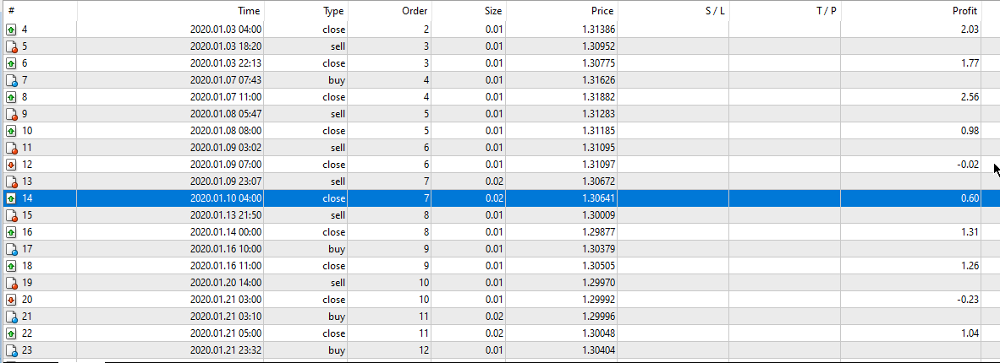
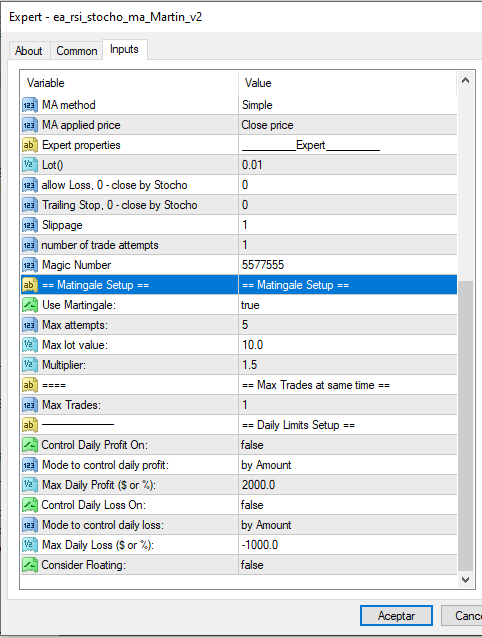

# rsi_stocho_ma_Martin EA v2

> Source: https://fxcodebase.com/code/viewtopic.php?f=38&t=73495  
> Forum: 38 · Topic 73495 · 3 post(s)

---

## rsi_stocho_ma_Martin EA v2

**Apprentice** · Sat Mar 18, 2023 2:51 am

 

Based on the request.
[https://fxcodebase.com/code/viewtopic.php?f=38&t=73468](https://fxcodebase.com/code/viewtopic.php?f=38&t=73468)

 [rsi_stocho_ma_Martin EA v2.mq4](files/150038/rsi_stocho_ma_Martin%20EA%20v2.mq4)

---

## Re: rsi_stocho_ma_Martin EA v2

**psjohn** · Mon Mar 20, 2023 2:44 am

Hello, I'm new to this forum. I'm trying to install this EA on my MT4 but it's instantly removed by itself. What's wrong did I do?

---

## Re: rsi_stocho_ma_Martin EA v2

**Apprentice** · Sat Apr 01, 2023 8:19 am

We only add a few features.
The Original code has those validations.
