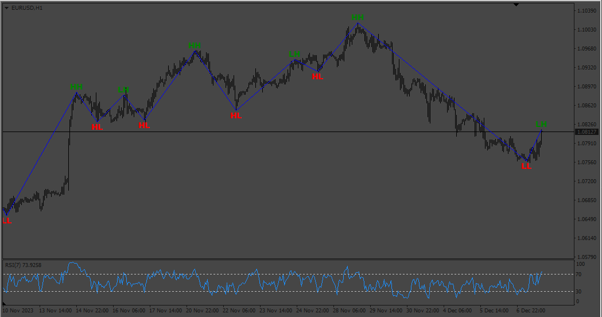

# RSI_SWING_INDICATOR

> Source: https://fxcodebase.com/code/viewtopic.php?f=38&t=74427  
> Forum: 38 · Topic 74427 · 4 post(s)

---

## RSI_SWING_INDICATOR

**Apprentice** · Sun Dec 10, 2023 3:32 am

TS2 version.
[https://fxcodebase.com/code/viewtopic.php?f=17&p=153532](https://fxcodebase.com/code/viewtopic.php?f=17&p=153532)

 [RSI_SWING_INDICATOR.mq4](files/153620/RSI_SWING_INDICATOR.mq4)

---

## Re: RSI_SWING_INDICATOR

**Satya264** · Fri May 10, 2024 9:52 am

make EA BASE ON THIS INDICATOR
CLOSE BY MONEY
CLOSE ON OPPOSITE
TP SL AND TSL

---

## Re: RSI_SWING_INDICATOR

**Apprentice** · Fri May 17, 2024 4:46 pm

We have added your request to the development list.
Development reference 403

---

## Re: RSI_SWING_INDICATOR

**Apprentice** · Wed May 29, 2024 9:38 am

[RSI_SWING_INDICATOR_MOD.mq4](files/155560/RSI_SWING_INDICATOR_MOD.mq4)

 [RSI_SWING_EA_v1.00.mq4](files/155560/RSI_SWING_EA_v1.00.mq4)
