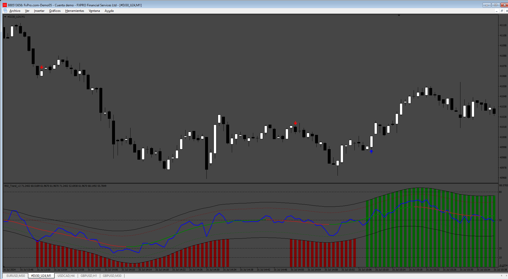

# RSI_Trend_v2

> Source: https://fxcodebase.com/code/viewtopic.php?f=38&t=75124  
> Forum: 38 · Topic 75124 · 10 post(s)

---

## RSI_Trend_v2

**Apprentice** · Sat Aug 10, 2024 7:37 pm

Based on the request.
[https://fxcodebase.com/code/viewtopic.p ... 53#p156153](https://fxcodebase.com/code/viewtopic.php?f=17&p=156153#p156153)

 [RSI_Trend_v2.mq4](files/156383/RSI_Trend_v2.mq4)

---

## Re: RSI_Trend_v2

**pugspuggy** · Sun Aug 11, 2024 8:51 am

Can this be made into an EA?

---

## Re: RSI_Trend_v2

**Apprentice** · Thu Aug 15, 2024 5:44 am

We have added your request to the development list.
Development reference 658

---

## Re: RSI_Trend_v2

**KUSHI90** · Sat Aug 17, 2024 4:40 am

> **Apprentice wrote:**
>
>
> 584.png
>
>
> Based on the request.
> [https://fxcodebase.com/code/viewtopic.p ... 53#p156153](https://fxcodebase.com/code/viewtopic.php?f=17&p=156153#p156153)
>
>
> RSI_Trend_v2.mq4

sir thanks, making this function, sir if can make this indicator to mq5 verison

---

## Re: RSI_Trend_v2

**alema0** · Tue Aug 20, 2024 2:19 pm

Would it be possible to add buy and sell buffers for the indicator arrows? Thanks

---

## Re: RSI_Trend_v2

**Apprentice** · Wed Aug 21, 2024 4:21 pm

We have added your request to the development list.
Development reference 664

---

## Re: RSI_Trend_v2

**Sohagbd221** · Wed Sep 11, 2024 4:29 am

can you fixed sound popup alert...only arrow apper time get popup sound..but this give me continue popup alert after arrow candle close

---

## Re: RSI_Trend_v2

**VuxxLong** · Fri Sep 13, 2024 2:32 am

Can you provide the Mq5 version of this EA?
Thank,

---

## Re: RSI_Trend_v2

**Apprentice** · Sat Sep 14, 2024 3:38 am

We have added your request to the development list.
Development reference 709

---

## Re: RSI_Trend_v2

**Apprentice** · Wed Sep 25, 2024 3:12 pm

 [RSI_Trend_v3.mq4](files/156788/RSI_Trend_v3.mq4)

 [RSI_Trend_v3_EA_v1.00.mq4](files/156788/RSI_Trend_v3_EA_v1.00.mq4)

 [RSI_Trend_v3.mq5](files/156788/RSI_Trend_v3.mq5)

 [RSI_Trend_v3_EA_v1.00.mq5](files/156788/RSI_Trend_v3_EA_v1.00.mq5)
