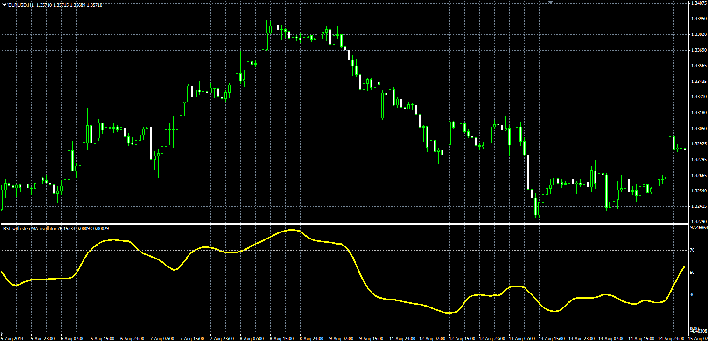

# RSI with step MA oscillator

> Source: https://fxcodebase.com/code/viewtopic.php?f=38&t=60019  
> Forum: 38 · Topic 60019 · 1 post(s)

---

## RSI with step MA oscillator

**Alexander.Gettinger** · Fri Nov 29, 2013 2:02 pm

Formulas:
RSI[i] = 100-(100/(1+Positive/Negative)), where
Positive, Negative - sum of positive and negative changes of Diff,
Diff[i] = MA[i]-MA[i-Step].

 

Download:

 [RSI_With_Step_MA.mq4](files/91227/RSI_With_Step_MA.mq4)
