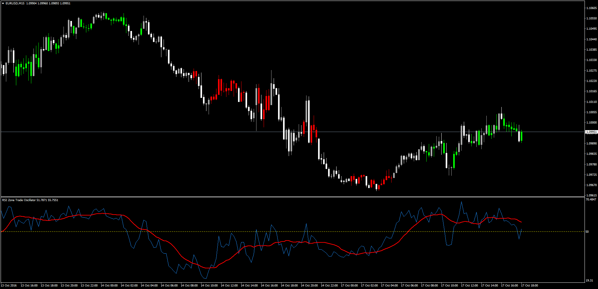

# RSI Zone Trade

> Source: https://fxcodebase.com/code/viewtopic.php?f=38&t=63984  
> Forum: 38 · Topic 63984 · 1 post(s)

---

## RSI Zone Trade

**Apprentice** · Mon Oct 17, 2016 1:53 pm

LUA Original: [viewtopic.php?f=17&t=2345](https://fxcodebase.com/code/viewtopic.php?f=17&t=2345)

Description:

This indicator will color the candles according to the following conditions.

Positive Zone (green):

RSI (x) > 50
AND
RSI(x) > Moving Average(X) of RSI

Negative Zone (Red):

RSI (x) < 50
AND
RSI(x) < Moving Average(X) of RSI

An additional feature has been added: to select the inverse crossing of the RSI with the MA of that RSI, always at the same side of the 50 line for positive and negative analysis.

An Oscillator of those conditions has been incorporated as well for easier visualization.

 [RSI_Zone_Trade.mq4](files/108634/RSI_Zone_Trade.mq4)

 [RSI_Zone_Trade_Oscillator.mq4](files/108634/RSI_Zone_Trade_Oscillator.mq4)
