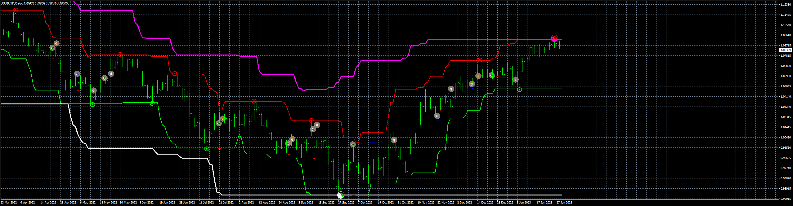

# RSS_EA

> Source: https://fxcodebase.com/code/viewtopic.php?f=38&t=73296  
> Forum: 38 · Topic 73296 · 4 post(s)

---

## RSS_EA

**Apprentice** · Tue Jan 31, 2023 7:44 am

Based on the request.
[https://fxcodebase.com/code/viewtopic.php?f=27&p=149120](https://fxcodebase.com/code/viewtopic.php?f=27&p=149120)

 [RSS v3 Double Channels-Indicator.mq4](files/149381/RSS%20v3%20Double%20Channels-Indicator.mq4)

 [RSS_EA_v1.00.mq4](files/149381/RSS_EA_v1.00.mq4)

---

## Re: RSS_EA

**Imperial_sam** · Wed Jan 03, 2024 2:06 pm

This Indicator is repaint or non repaint ??
or in other words , if it is repaint indicator can you make it non repaint ??

---

## Re: RSS_EA

**Apprentice** · Wed Jan 10, 2024 7:33 am

We have added your request to the development list.
Development reference 54

---

## Re: RSS_EA

**Apprentice** · Sat Feb 24, 2024 1:38 pm

[RSS_v4_Double_Channels-Indicator.mq4](files/154481/RSS_v4_Double_Channels-Indicator.mq4)

Try this version.
