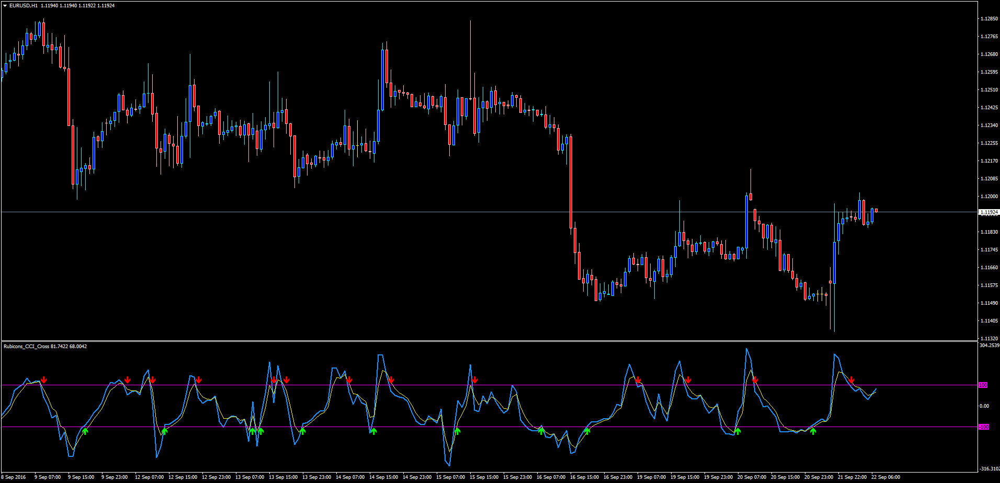

# Rubicons_CCI_Cross

> Source: https://fxcodebase.com/code/viewtopic.php?f=38&t=63886  
> Forum: 38 · Topic 63886 · 1 post(s)

---

## Rubicons_CCI_Cross

**Apprentice** · Thu Sep 22, 2016 3:04 am

TS2/Marketscope version.
[viewtopic.php?f=17&t=613&p=108168#p108168](https://fxcodebase.com/code/viewtopic.php?f=17&t=613&p=108168#p108168)
[viewtopic.php?f=17&t=613&p=108168#p108168](https://fxcodebase.com/code/viewtopic.php?f=17&t=613&p=108168#p108168)
This is a CCI Oscillator with a 3-EMA period on its array that determine crosses between the two lines and the OB 100 and OS -100 levels to plot Short and Long Signals.
Customizable CCI period, EMA period and OB/OS Levels; and colors.

 [Rubicons_CCI_Cross.mq4](files/108217/Rubicons_CCI_Cross.mq4)
