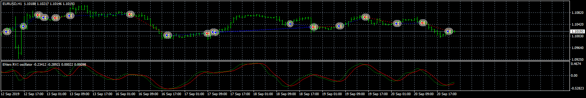
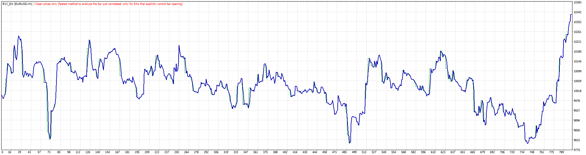
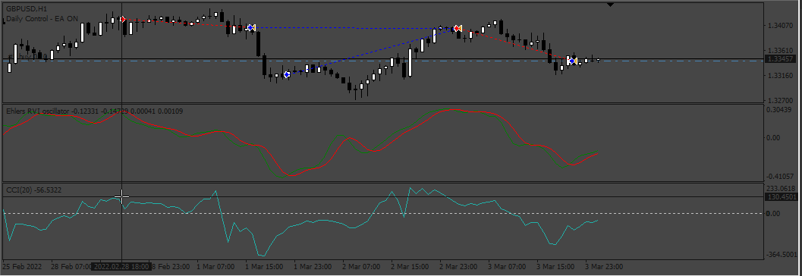

# RVI_EA

> Source: https://fxcodebase.com/code/viewtopic.php?f=38&t=69245  
> Forum: 38 · Topic 69245 · 13 post(s)

---

## RVI_EA

**Apprentice** · Wed Dec 18, 2019 5:02 pm

 

Based on request.
[viewtopic.php?f=27&t=69233](https://fxcodebase.com/code/viewtopic.php?f=27&t=69233)
Ehlers RVI oscillator
[viewtopic.php?f=38&t=60771](https://fxcodebase.com/code/viewtopic.php?f=38&t=60771)

 [RVI_EA.mq4](files/130327/RVI_EA.mq4)

---

## Re: RVI_EA

**Ludo69** · Fri Dec 27, 2019 10:00 am

Hi,

Thank for the EA
function in backtest but not fonction in real mode = code error 134.

regards,

Ludovic

---

## Re: RVI_EA

**Apprentice** · Fri Dec 27, 2019 10:43 am

Your request is added to the development list.
Development reference 496.

---

## Re: RVI_EA

**Apprentice** · Mon Dec 30, 2019 8:18 am

Fixed.

---

## Re: RVI_EA

**Ludo69** · Tue Dec 31, 2019 3:42 pm

Hi,

Fixed in a new version or need to download the first one again ?

regards,

Ludovic

---

## Re: RVI_EA

**Apprentice** · Fri Jan 03, 2020 3:51 am

The first/Topmost post was updated.

---

## Re: RVI_EA

**Imperial_sam** · Sat Jan 13, 2024 11:34 am

> **Apprentice wrote:**
>
>
> 1.png
>
>
>
>
> 2.gif
>
>
> Based on request.
> [viewtopic.php?f=27&t=69233](https://fxcodebase.com/code/viewtopic.php?f=27&t=69233)
> Ehlers RVI oscillator
> [viewtopic.php?f=38&t=60771](https://fxcodebase.com/code/viewtopic.php?f=38&t=60771)
>
>
> RVI_EA.mq4

Hi can you add filter for opening trade ??
Like , use CCI indicator levels to cross via RVI to open buy / sell trade.
For example, If RVI crosses above CCI -100 level its buy and vice versa.

---

## Re: RVI_EA

**Apprentice** · Sat Jan 13, 2024 3:21 pm

We have added your request to the development list.
Development reference 60

---

## Re: RVI_EA

**Apprentice** · Mon Jan 22, 2024 8:16 am

 [RVI_CCI_EA.mq4](files/154153/RVI_CCI_EA.mq4)

---

## Re: RVI_EA

**Imperial_sam** · Tue Jan 23, 2024 6:16 am

Thank you sir for this EA. But there is some misunderstanding for strategy.
SO there are 2 indicator in this strategy.
1) CCI - CCI levels are base of this strategy. CCI signal line has no work.
2) RVI - RVI line crossing has no work. RVI line crosses CCI level and trade is going to open. Not on RVI crossover.

For open BUY trade: RVI crosses Above CCI -100 Line.

For open SELL trade: RVI crosses Below CCI 100 Line.

I attached picture. so that if I am not able to make you understand through words, picture may help.

 

---

## Re: RVI_EA

**Apprentice** · Tue Jan 23, 2024 2:44 pm

We have added your request to the development list.
Development reference 97

---

## Re: RVI_EA

**Imperial_sam** · Thu Mar 07, 2024 1:28 am

Sir Any update on it ??

---

## Re: RVI_EA

**Apprentice** · Wed Jan 15, 2025 5:22 am

 [RVI_CCI_EA.mq4](files/157824/RVI_CCI_EA.mq4)
