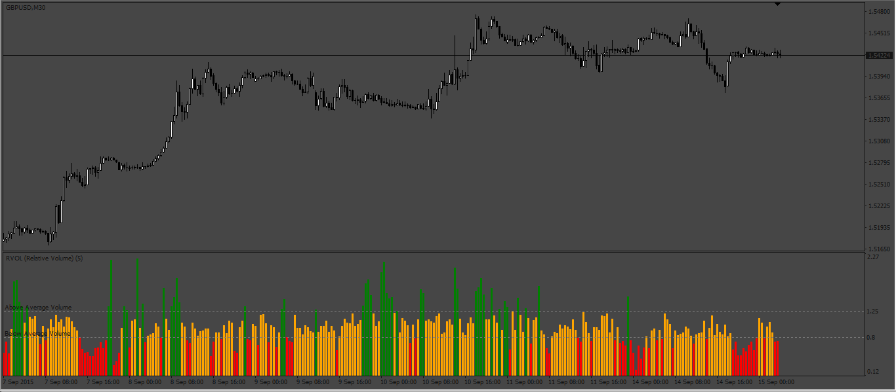
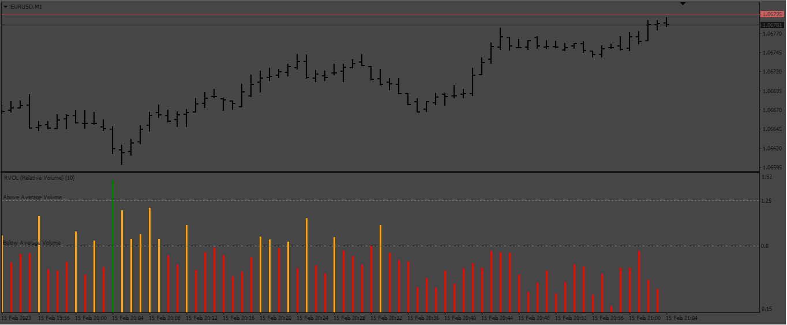
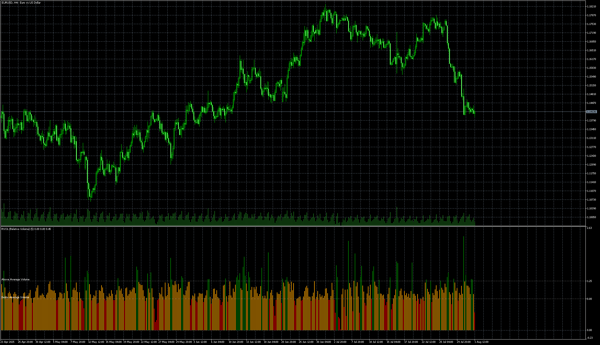

# RVOL

> Source: https://fxcodebase.com/code/viewtopic.php?f=38&t=72041  
> Forum: 38 · Topic 72041 · 9 post(s)

---

## RVOL

**Apprentice** · Mon Apr 04, 2022 2:03 pm

Based on the request.
[https://fxcodebase.com/code/viewtopic.php?f=27&p=143857](https://fxcodebase.com/code/viewtopic.php?f=27&p=143857)

 [RVOL.mq4](files/145549/RVOL.mq4)

---

## Re: RVOL

**logicgate** · Mon Apr 04, 2022 4:51 pm

That is awesome, thanks buddy!

---

## Re: RVOL

**logicgate** · Sat Apr 09, 2022 10:49 am

Hi there buddy. Can we get a version for MT5 too?

Can you correct the code to allow us to configure the levels on the indicator? Levels description, color, line style... If you check on the MT4 version, if you try to change those settings, it´s not possible.

Best regards

---

## Re: RVOL

**Apprentice** · Sat Apr 09, 2022 12:16 pm

Your request is added to the development list.
Development reference 223.

---

## Re: RVOL might have a little bug

**goFrankygo** · Tue Feb 14, 2023 11:05 am

Hello and thanks you very much for providing the rvol.mq4 file. It was a great help to get it and even better than the one I had.

It happens that the rvol.mql indicator does not displays the volume related colors correctly.
I used this indicator on a demo and a live account of the same broker and unfortunately the colors on the live and demo account were different.

Is it possible that there is a little bug in the code?

Could you please check it?
Thanks a lot in advance...
Frank

---

## Re: RVOL

**Apprentice** · Wed Feb 15, 2023 3:05 am

We have added your request to the development list.
Development reference 151.

---

## Re: RVOL

**goFrankygo** · Wed Feb 15, 2023 3:49 am

Thank you!!!

---

## Re: RVOL

**Apprentice** · Thu Feb 16, 2023 3:25 pm

 

The indicator was cheked and are working fine, take a look of my pics in EURUSD M1, are exactly the same. And checking your pics the colors of the indicator are ok follow the indicator logic (green above Average volume, red below...). I think the issue is the broker give you diferent volume data betwen demo account and live account.

---

## Re: RVOL

**Apprentice** · Fri Aug 01, 2025 6:06 am

 [RVOL.mq5](files/160100/RVOL.mq5)
