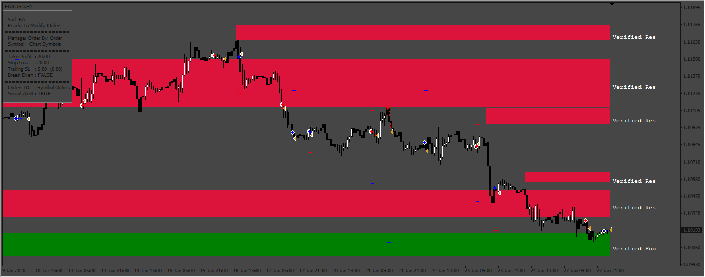
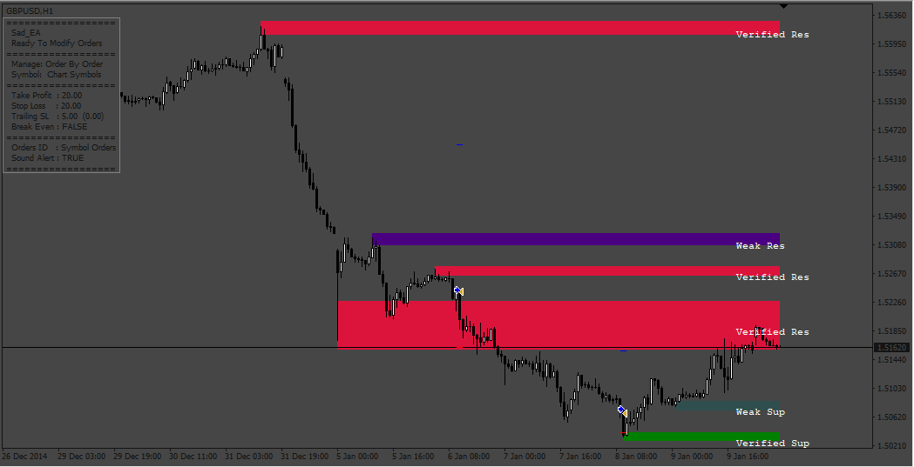

# Sad_EA

> Source: https://fxcodebase.com/code/viewtopic.php?f=38&t=73556  
> Forum: 38 · Topic 73556 · 9 post(s)

---

## Sad_EA

**Apprentice** · Sat Apr 01, 2023 9:01 am

Based on the request.
[https://fxcodebase.com/code/viewtopic.php?f=27&p=150093](https://fxcodebase.com/code/viewtopic.php?f=27&p=150093)

 [Sad_EA.mq4](files/150228/Sad_EA.mq4)

 [shved_supply_and_demand_mod_v1.ex4](files/150228/shved_supply_and_demand_mod_v1.ex4)

 [shved_supply_and_demand_mod_v1.mq4](files/150228/shved_supply_and_demand_mod_v1.mq4)

---

## Re: Sad_EA

**quintana** · Sat Apr 01, 2023 9:55 am

can you attached "shved_supply_and_demand mod v1" in mql4 ( not mql5 )
and not "shved_supply_and_demand_mod v1"
thanks

---

## Re: Sad_EA

**Apprentice** · Mon Apr 03, 2023 7:54 am

All codes are in MQL4
EX4 is coded version of MQL4

---

## Re: Sad_EA

**murilovagner** · Thu Apr 06, 2023 8:25 am

Hello thanks for the work.

I am not able to make the EA send orders, is there any specific configuration?

Thanks

---

## Re: Sad_EA

**Apprentice** · Wed Apr 12, 2023 4:07 am

We have added your request to the development list.
Development reference 328.

---

## Re: Sad_EA

**Apprentice** · Sat Apr 15, 2023 4:41 am

Sad_EA was updated.

---

## Re: Sad_EA

**murilovagner** · Sat Apr 22, 2023 9:54 am

Hello, I cannot find the updated version, it appears to me that the EA needs an indicator, but I have already inserted it in the MQL4 indicator folder.

---

## Re: Sad_EA

**Apprentice** · Sat Apr 22, 2023 11:50 am

We have re-uploaded the previous file.

---

## Re: Sad_EA

**TomBrooks** · Mon Jun 30, 2025 2:57 am

I have already placed it in the MQL4 indicator directory.
