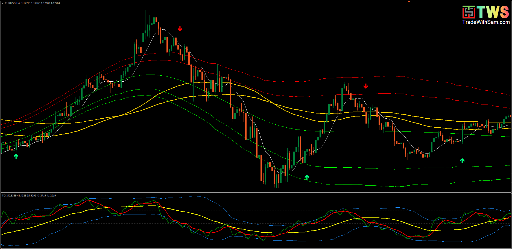
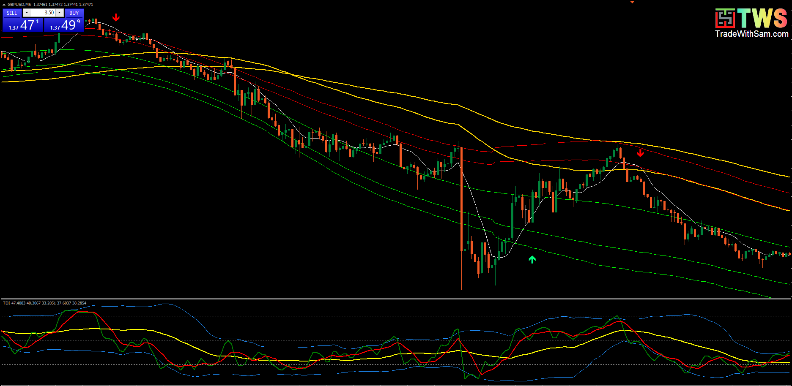
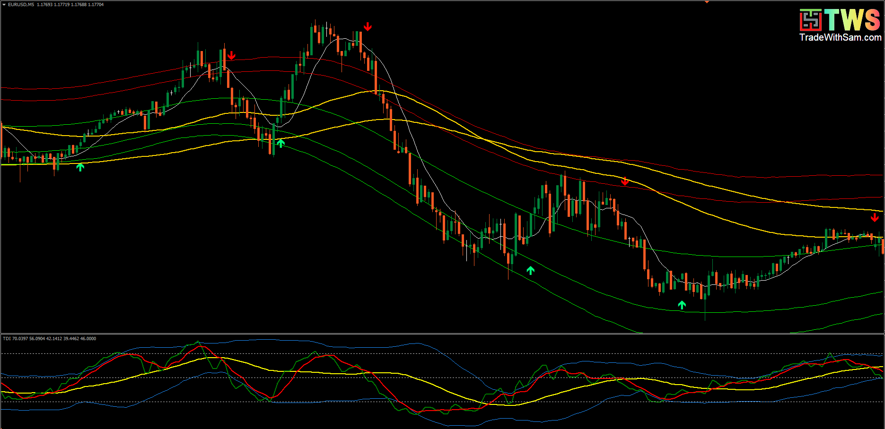

# Sam’s Trend Blaster indicator - Unlimit

> Source: https://fxcodebase.com/code/viewtopic.php?f=38&t=71477  
> Forum: 38 · Topic 71477 · 3 post(s)

---

## Sam’s Trend Blaster indicator - Unlimit

**Javeir** · Sun Sep 05, 2021 9:26 pm

Sam’s Trend Blaster indicator

Sam’s Trend Blaster indicator tracks the market trend with unmatched reliability. It has been designed to trend-trade intraday charts on any timeframes. Its winning ratio is around 85%.

 

 

 

---

## Re: Sam’s Trend Blaster indicator - Unlimit

**penuel** · Thu Sep 23, 2021 9:53 am

> **Javeir wrote:**
> Sam’s Trend Blaster indicator
>
> Sam’s Trend Blaster indicator tracks the market trend with unmatched reliability. It has been designed to trend-trade intraday charts on any timeframes. Its winning ratio is around 85%.
>
>
>
> Screenshot-2021-07-24-122658.png
>
>
>
>
>
> Screenshot-2021-07-24-124723.png
>
>
>
>
>
> Screenshot-2021-07-24-124100.png

I tried to make use of the indicator but it did not work most especially the Sam's trend blaster. Is there anything I could do to it?
Thanks.

---

## Re: Sam’s Trend Blaster indicator - Unlimit

**Apprentice** · Fri Sep 24, 2021 6:25 am

Unfortunately no.
