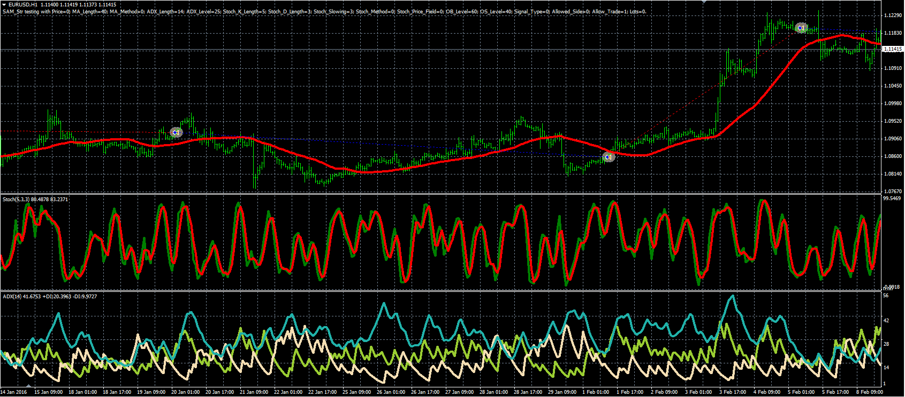

# SAM strategy

> Source: https://fxcodebase.com/code/viewtopic.php?f=38&t=63590  
> Forum: 38 · Topic 63590 · 1 post(s)

---

## SAM strategy

**Alexander.Gettinger** · Thu Jun 09, 2016 5:25 pm

The strategy based on the Stochastic, ADX, and moving average indicators.

Buy condition: Close>MA, ADX<ADX_Level, Stoch K<OS_Level and Stoch K crosses above Stoch D.
Sell condition: Close<MA, ADX<ADX_Level, Stoch K>OB_Level and Stoch K crosses above Stoch D.

 

Download:

 [SAM_Str.mq4](files/106708/SAM_Str.mq4)
