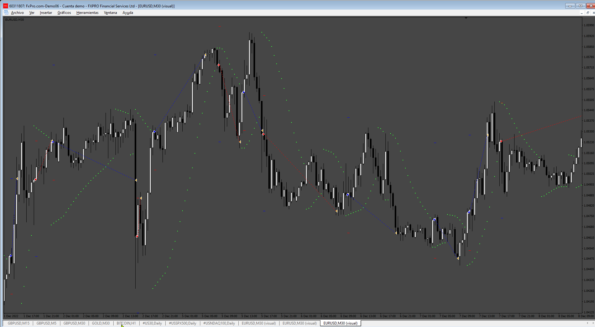
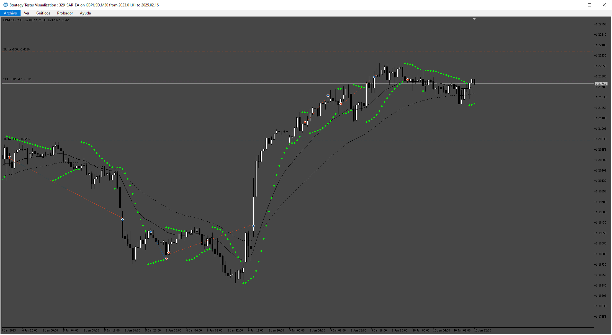
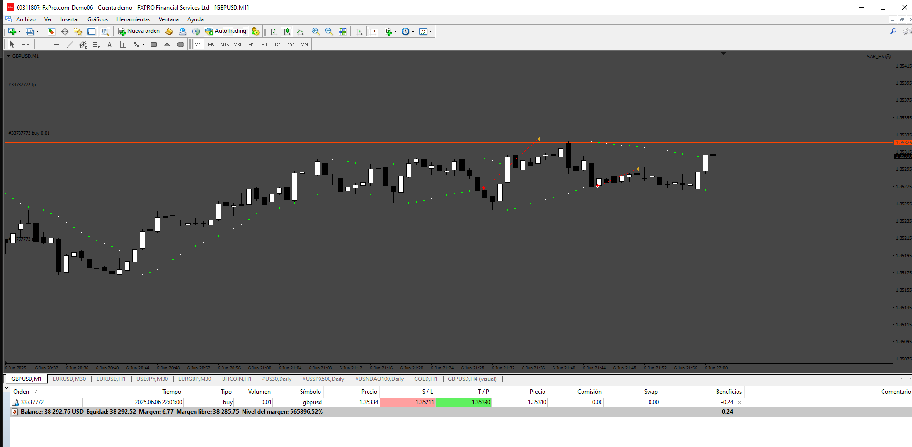

# SAR_EA

> Source: https://fxcodebase.com/code/viewtopic.php?f=38&t=75928  
> Forum: 38 · Topic 75928 · 16 post(s)

---

## SAR_EA

**Apprentice** · Tue May 13, 2025 3:40 am

Based on the request.
[https://fxcodebase.com/code/viewtopic.php?f=38&t=75852](https://fxcodebase.com/code/viewtopic.php?f=38&t=75852)

 [SAR_EA.mq4](files/159218/SAR_EA.mq4)

---

## Re: SAR_EA

**BeingSimple** · Wed May 14, 2025 10:12 pm

Thank you so much Apprentice bro...
I was waiting patiently for your response on my request....

SO, THANK YOU SO MUCH FOR YOUR SUPPORT.

---

## Re: SAR_EA

**BeingSimple** · Wed May 14, 2025 10:16 pm

Hello bro..
I had put ur EA on demo account for testing on
XAUUSD 5 minute chart on Exness Account ( 3 Digit)

But sadly... for some reason, when the SAR changed trend
The EA did not take any trades...
I waited for 3 trend change of SAR and still it did not take any trade.
Please check the Attachment.

On your EA build post, you attached an image of an EURUSD M30 chart and some successful trades taken there.
Then why it dint take any trade...
Kindly check the EA brother... Eagerly awaiting your response post on this..>

Thank you

---

## Re: SAR_EA

**BeingSimple** · Wed May 14, 2025 10:58 pm

Again Trend changed few times... yet no trades bro...
Please find the attachment...

---

## Re: SAR_EA

**BeingSimple** · Thu May 15, 2025 2:09 pm

Brother..
I was eagerly waiting for so many hours... but sadly
No trade for whole day... please check the attachment.
Sorry to disturb you. Just wanted to share you the feedback.

Thank you

---

## Re: SAR_EA

**VuxxLong** · Fri May 16, 2025 9:20 am

Can you convert this EA to mt5?

Thank you.

---

## Re: SAR_EA

**Apprentice** · Sat May 17, 2025 11:02 am

We have added your request to the development list.
Development reference 329

---

## Re: SAR_EA

**BeingSimple** · Mon May 19, 2025 12:45 am

> **Apprentice wrote:**
> We have added your request to the development list.
> Development reference 329

THank you brother...
Will be waiting for the response...

---

## Re: SAR_EA

**BeingSimple** · Tue May 20, 2025 8:58 pm

> **Apprentice wrote:**
> We have added your request to the development list.
> Development reference 329

Dear Brother...
Please add this request also in the making of the EA as an addition

EA should " TURN OFF - AutoTrading" and/or "CLOSE-All orders"
[Input should have options to select Both functions or only one]

a. Once the set PNL is reached.Both LOSS or PROFIT ( example : User should be able to set, if PNL is -50, EA should get triggered)
b. Once the X+1 number of orders are reached ( example : Total Orders Allowed is X = 10, the moment 11th order is placed, EA should get triggered)
c. Once the lot size exceeds Y ( example : Max. Lot Size allowed is Y = 0.04, the moment an order with lot size 0.05 is opened, EA should get triggered)

Following 5 parameters are important in inputs : -
1. Close on PNL Allowed - Profit (ex 50) or Loss (ex -50)
2. Max. number of Orders Allowed - X
3. Max. Lot size Allowed - Y ( plz keep format in decimals 00.00 )
On Above Condition Triggers
4. TURN OFF AutoTrading - True / False
5. CLOSE ALL ORDERS - True / False

PS : Brother, you have already done this as a separate Account Management EA before
( [https://fxcodebase.com/code/viewtopic.php?f=27&t=75590](https://fxcodebase.com/code/viewtopic.php?f=27&t=75590) )
Just wanted to add that function here with PNL feature.

---

## Re: SAR_EA

**Apprentice** · Wed May 21, 2025 1:15 pm

Task 329

 [SAR_EA.mq4](files/159313/SAR_EA.mq4)

 [SAR_EA.mq5](files/159313/SAR_EA.mq5)

---

## Re: SAR_EA

**BeingSimple** · Sat May 24, 2025 3:41 pm

> **Apprentice wrote:**
>
>
> 329.png
>
>
> Task 329
>
>
> SAR_EA.mq4
>
>
>
>
> SAR_EA.mq5

THANK YOU SO MUCH BROTHER
Sorry that i somehow missed your message for past 2-3 days ... Lot of pressures in life that, i loose track of my routines too.
Anyway, RESPECTS & THank you for the efforts and the EA

I will try it on demo account on monday.

THANK YOU @APPRENTICE BRO....

---

## Re: SAR_EA

**BeingSimple** · Sun May 25, 2025 11:23 am

> **Apprentice wrote:**
>
>
> The attachment **329.png** is no longer available
>
>
> Task 329
>
>
> The attachment **329.png** is no longer available
>
>
>
>
> The attachment **329.png** is no longer available

Dear Brother...
i tried this EA on BTCUSD today Live Trading (as XAUUSD trading not available-weekend).

For some reason, LIVE TRADING NOT HAPPENING in BTCUSD (Image 1)
XAUUSD / BTCUSD BACKTEST - Successfully happening for both (Image 2)

I have attached images for both.
Can you kindly check bro...

1. is it because of decimals ? which differs some broker to broker
2. is the EA locked to XAUUSD trading alone (which i dont think so) ?

THank you bro...

PS :
I will check XAUUSD live trading on monday & give feedback

---

## Re: SAR_EA

**BeingSimple** · Sun May 25, 2025 9:04 pm

> **Apprentice wrote:**
>
>
> The attachment **329.png** is no longer available
>
>
> Task 329
>
>
> The attachment **329.png** is no longer available
>
>
>
>
> The attachment **329.png** is no longer available

Hello Apprentice bro...
Sorry to disturb you again... I wanted to leave you feedbacks about the EA.

1. I tried the EA on
XAUUSD - It ran successfully
BTCUSD - It ran successfully (after i restarted terminal)

**But on both charts...
EA is struck exactly after 2 trades.. no further trades are taken by EA.**
It has been many hours since i started the EA on BTCUSD... and still no trades after 2 trades
On both the charts, the EA is running well in Backtests.

Please find attachment of both the Charts with EA on it.

 

*EA not picking trades after 2 trades*

 

Please do the needful... _/\_
Thank you brother...

---

## Re: SAR_EA

**BeingSimple** · Sun May 25, 2025 10:37 pm

> **Apprentice wrote:**
>
>
> The attachment **329.png** is no longer available
>
>
> Task 329
>
>
> The attachment **329.png** is no longer available
>
>
>
>
> The attachment **329.png** is no longer available

Hello bro...
Just updating you with happenings... Something new happened

1. In BTCUSD Still no trades happening... I tried restarting terminal & Reloading EA.Still no trade
(Image 1)

 

*After 2 initial trades. No other Trades triggered.*

2. In XAUUSD one BUY has been skipped.
a. One Buy Order happened. Got SL hit
b. One sell order happened & it exited due to signal reversed in SAR **but the Reverse Signal DID NOT trigger a buy order**
c. Again SAR signal reversed & Sell order has been triggered. Last buy order signal has been skipped but that gave a good profitable movement.
(Please check the Below Images 2 & 3)

 

*No buy order happened But previous sell order exited on reverse signal.*

 

*New sell order triggered directly on signal skipping the Previous buy signal*

---

## Re: SAR_EA

**BeingSimple** · Mon May 26, 2025 12:14 pm

> **Apprentice wrote:**
>
>
> The attachment **329.png** is no longer available
>
>
> Task 329
>
>
> The attachment **329.png** is no longer available
>
>
>
>
> The attachment **329.png** is no longer available

Latest Updates of EA

It is taking trades as it likes bro.. many signals missed & i dont know how to narrate it
So i am attaching the image for your observation.
kindly look into it & do the needful...
this will be my last update so as to not disturb you again & again
& will wait for your response bro...

Thank you

 

*many signals missed*

---

## Re: SAR_EA

**Apprentice** · Sat Jun 07, 2025 7:58 am

 [SAR_EA_v2.mq4](files/159523/SAR_EA_v2.mq4)
