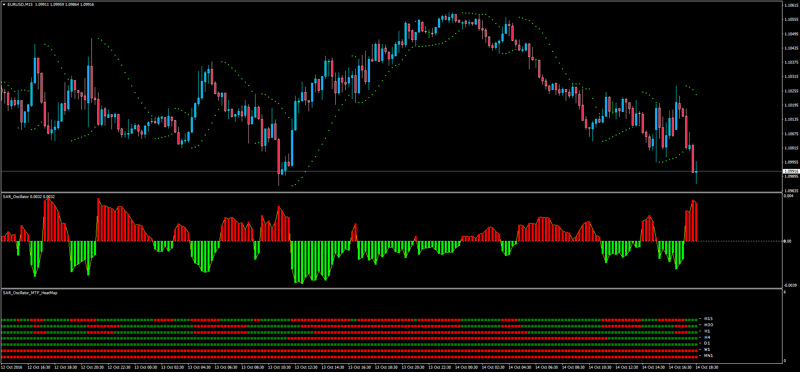

# SAR Oscillator + MTF Heatmap

> Source: https://fxcodebase.com/code/viewtopic.php?f=38&t=63980  
> Forum: 38 · Topic 63980 · 1 post(s)

---

## SAR Oscillator + MTF Heatmap

**Apprentice** · Sat Oct 15, 2016 12:37 pm

LUA Original: [viewtopic.php?f=17&t=1259](https://fxcodebase.com/code/viewtopic.php?f=17&t=1259)

Description:

Histogram Oscillator with the difference between the Parabolic SAR and the Close of each candle. A custom Multi Time Frame Heat Map has been added as well to use it in conjunction or separately.

Formula:
SAR oscillator = SAR - Close

 [SAR_Oscillator.mq4](files/108612/SAR_Oscillator.mq4)

 [SAR_Oscillator_MTF_Heatmap.mq4](files/108612/SAR_Oscillator_MTF_Heatmap.mq4)
