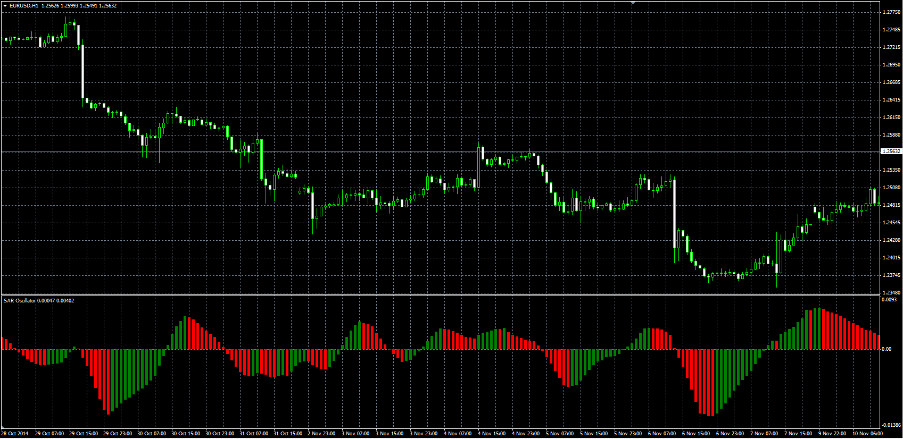

# SAR Oscillator

> Source: https://fxcodebase.com/code/viewtopic.php?f=38&t=61490  
> Forum: 38 · Topic 61490 · 1 post(s)

---

## SAR Oscillator

**Alexander.Gettinger** · Thu Nov 20, 2014 10:08 am

Original LUA oscillator: [viewtopic.php?f=17&t=13598](https://fxcodebase.com/code/viewtopic.php?f=17&t=13598).

Formulas:
SARO = MVA(CloseSAR) with [MA_Length] number of periods, where
CloseSAR = Close - SAR,
SAR - Parabolic Stop and Reverse with [SAR_Step] and [SAR_Max] parameters.

 

Download:

 [SAR_Oscillator.mq4](files/97217/SAR_Oscillator.mq4)
