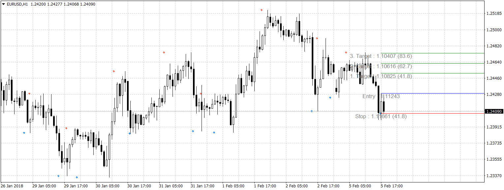
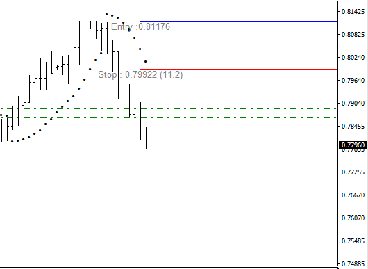
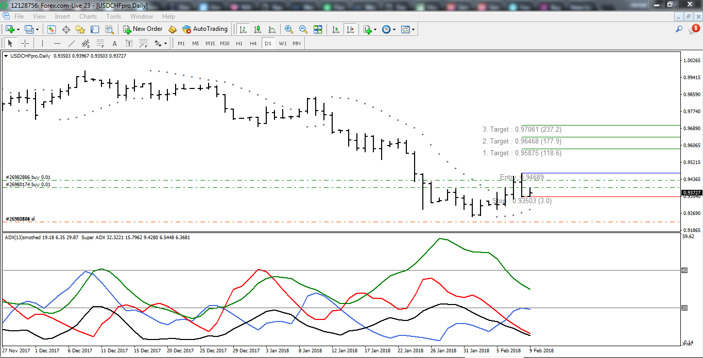

# SAR Price Targets

> Source: https://fxcodebase.com/code/viewtopic.php?f=38&t=65696  
> Forum: 38 · Topic 65696 · 9 post(s)

---

## SAR Price Targets

**Apprentice** · Mon Feb 05, 2018 1:46 pm

Lua original.
[viewtopic.php?f=17&t=65501](https://fxcodebase.com/code/viewtopic.php?f=17&t=65501)

 [SAR Price Targets.mq4](files/117575/SAR%20Price%20Targets.mq4)

---

## Re: SAR Price Targets

**nookie** · Mon Feb 05, 2018 4:29 pm

This is somehow not working and it is only showing "Open long" in downtrends

---

## Re: SAR Price Targets

**Apprentice** · Mon Feb 05, 2018 5:33 pm

Try it now.

---

## Re: SAR Price Targets

**jrichardson83** · Thu Feb 08, 2018 1:25 pm

> **Apprentice wrote:**
> Try it now.

I think it is still misreading. It's giving a signal for a long entry when it should be giving a signal for a short.

 

---

## Re: SAR Price Targets

**Apprentice** · Fri Feb 09, 2018 7:02 am

What timeframe does he use?

---

## Re: SAR Price Targets

**jrichardson83** · Fri Feb 09, 2018 8:42 am

> **Apprentice wrote:**
> What timeframe does he use?

This is a daily chart. I didn't look to see if there was a way to manipulate the timeframe within the indicator. MT4 isnt' like Marketscope where you can choose the timeframe from within the indicator.

---

## Re: SAR Price Targets

**jrichardson83** · Fri Feb 09, 2018 8:47 am

> **Apprentice wrote:**
> What timeframe does he use?

This is a daily chart of the USDCHF. The indicator is showing the correct signal direction, but it is 3 bars late. The built in PSAR in MT4 painted a trend change on February 5th but the SAR Price Target indie didn't paint the entry until February 8th.

 

---

## Re: SAR Price Targets

**Apprentice** · Fri Feb 09, 2018 11:17 am

Try it now.

---

## Re: SAR Price Targets

**Apprentice** · Thu Feb 15, 2018 6:30 am

Trigger line added.
