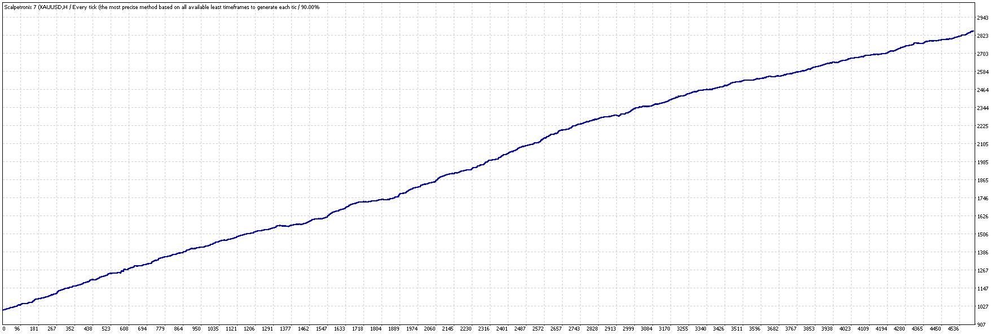

# Scalper robot for M5 timeframe - Scalpetronix.

> Source: https://fxcodebase.com/code/viewtopic.php?f=38&t=75569  
> Forum: 38 · Topic 75569 · 5 post(s)

---

## Scalper robot for M5 timeframe - Scalpetronix.

**kotephone** · Tue Feb 04, 2025 4:14 pm

The latest version of the Scalpetronix v7.0 robot

The robot is multi-currency, but since multi-currency bots are not tested in the MetaTrader4 strategy tester, we launch it on XAUUSD M5. In real trading, the bot automatically analyzes several currency pairs and trades on them simultaneously. In this case, you only need to install it on the XAUUSD M5 timeframe
We recommend a minimum spread and minimum commissions since the bot is a SCALPER!
The minimum balance to start trading is $ 1000
Over the past month, the bot brought 117% profit. In December, it was 132%
Download the robot file and test it!

In this topic, we will publish all the news on this robot!

 [Scalpetronix 7.ex4](files/158106/Scalpetronix%207.ex4)

 

---

## Re: Scalper robot for M5 timeframe - Scalpetronix.

**kotephone** · Sat Feb 08, 2025 4:58 am

The robot is best launched on XAUUSD M5

---

## Re: Scalper robot for M5 timeframe - Scalpetronix.

**kenny22** · Mon Feb 10, 2025 7:31 am

Is this a free EA?

---

## Re: Scalper robot for M5 timeframe - Scalpetronix.

**Mahadeo1806** · Thu Feb 13, 2025 12:23 am

its not taking order

we put it on mt4 last 4 days

---

## Re: Scalper robot for M5 timeframe - Scalpetronix.

**kotephone** · Sat Mar 01, 2025 12:55 pm

> **Mahadeo1806 wrote:**
> its not taking order
>
> we put it on mt4 last 4 days

So the broker blocks the opening of transactions. Put it on another broker. For example, FXopen or similar, and everything will work.
