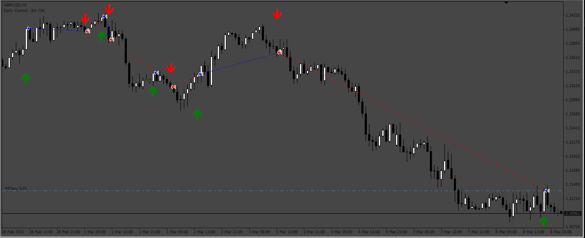
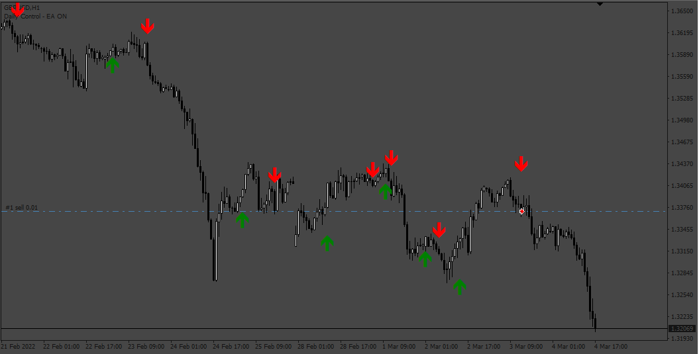

# Scalper_X2 EA

> Source: https://fxcodebase.com/code/viewtopic.php?f=38&t=74608  
> Forum: 38 · Topic 74608 · 4 post(s)

---

## Scalper_X2 EA

**Apprentice** · Sat Feb 10, 2024 11:45 am

Based on the request.
[https://fxcodebase.com/code/viewtopic.php?f=27&p=154261](https://fxcodebase.com/code/viewtopic.php?f=27&p=154261)

 [Scalper X2.ex4](files/154347/Scalper%20X2.ex4)

 [Scalper_X2 EA.mq4](files/154347/Scalper_X2%20EA.mq4)

---

## Re: Scalper_X2 EA

**TommyJeep** · Mon Feb 12, 2024 7:41 am

Thanks for the great work. This morning no orders were opened on an hourly chart with two signals, first sell and second buy, what could it be?

---

## Re: Scalper_X2 EA

**Apprentice** · Sat Mar 09, 2024 9:29 am

it’s working well, be sure to have the indicator intalled in the folder “Indicators”

 [Scalper_X2_EA.mq4](files/154610/Scalper_X2_EA.mq4)

---

## Re: Scalper_X2 EA

**Apprentice** · Wed May 22, 2024 2:35 pm

Version with the martingale.
[https://fxcodebase.com/code/viewtopic.php?f=27&t=74862](https://fxcodebase.com/code/viewtopic.php?f=27&t=74862)
