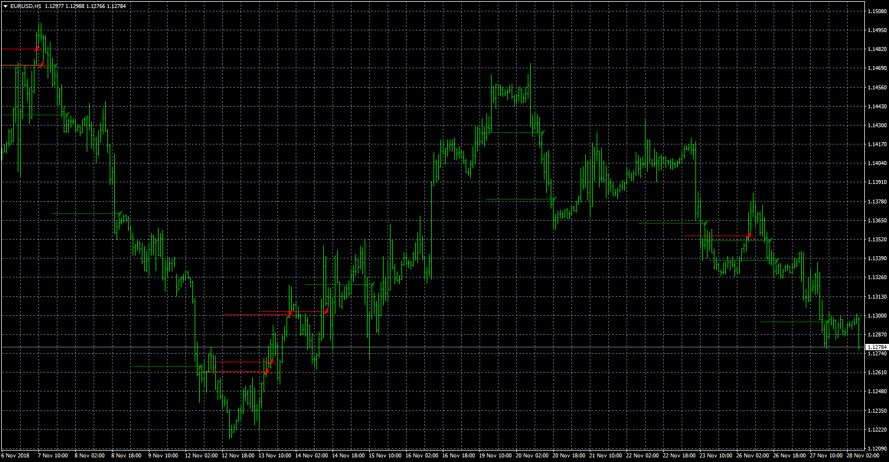

# Scalping indicator

> Source: https://fxcodebase.com/code/viewtopic.php?f=38&t=67015  
> Forum: 38 · Topic 67015 · 4 post(s)

---

## Scalping indicator

**Apprentice** · Wed Nov 28, 2018 4:57 am

 [Scalping indicator.mq4](files/122382/Scalping%20indicator.mq4)

 [Scalping EA.mq4](files/122382/Scalping%20EA.mq4)

Based on TS2/Lua version
[viewtopic.php?f=17&t=66885](https://fxcodebase.com/code/viewtopic.php?f=17&t=66885)

---

## Re: Scalping indicator

**ericcky** · Wed Sep 18, 2019 11:15 pm

Hi kind sir,

Are you able to do a version of the scalping EA to invert it's signals? Meaning if the original would have entered a BUY/LONG trade then the new EA would SELL/SHORT instead and vice versa.

I have forward tested the scalping EA, and within 3 days, my demo lost 5k So was thinking if we invert the signals, it could be the other way around.

Thank you for helping.

Have a great day

---

## Re: Scalping indicator

**Apprentice** · Mon Sep 23, 2019 5:56 am

Your request is added to the development list.
Development reference 116.

---

## Re: Scalping indicator

**Apprentice** · Wed Oct 02, 2019 4:35 am

EA already supports that (Logic type parameter)
