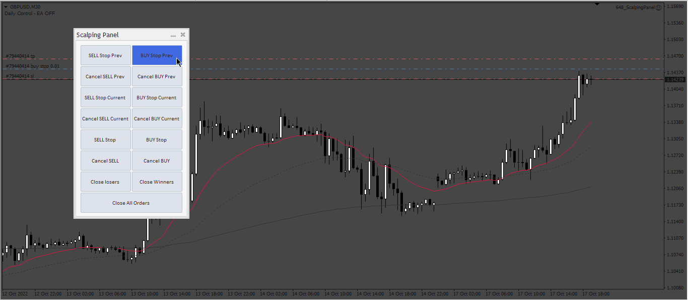

# ScalpingPanel

> Source: https://fxcodebase.com/code/viewtopic.php?f=38&t=72849  
> Forum: 38 · Topic 72849 · 4 post(s)

---

## ScalpingPanel

**Apprentice** · Tue Oct 18, 2022 1:33 am

Based on request.
[https://fxcodebase.com/code/viewtopic.php?f=27&p=147885](https://fxcodebase.com/code/viewtopic.php?f=27&p=147885)

 [ScalpingPanel.mq4](files/147941/ScalpingPanel.mq4)

---

## Re: ScalpingPanel

**AMC1979** · Tue Oct 18, 2022 6:35 am

Hi,

Thanks for creating this scalping panel.

There's an issue when placing the orders. Everytime you click the sell/buy stop previous & current buttons, the order is placed but cancelled automatically straight away for some reason.

With sell stop & buy stop buttons, sometimes the order is placed but other times these get cancelled too.

Could you please have a look.

One other thing, if you could add 2 more buttons, market sell & market buy. If you can place the market sell button above close losers and buy above close winners, that would be great.

I did send you a message before but maybe it reached you a bit late.

Thanks again!

---

## Re: ScalpingPanel

**Apprentice** · Sun Oct 23, 2022 3:15 am

We have added your request to the development list.
Development reference 671.

---

## Re: ScalpingPanel

**Apprentice** · Wed Oct 26, 2022 11:45 am

Try it now.
