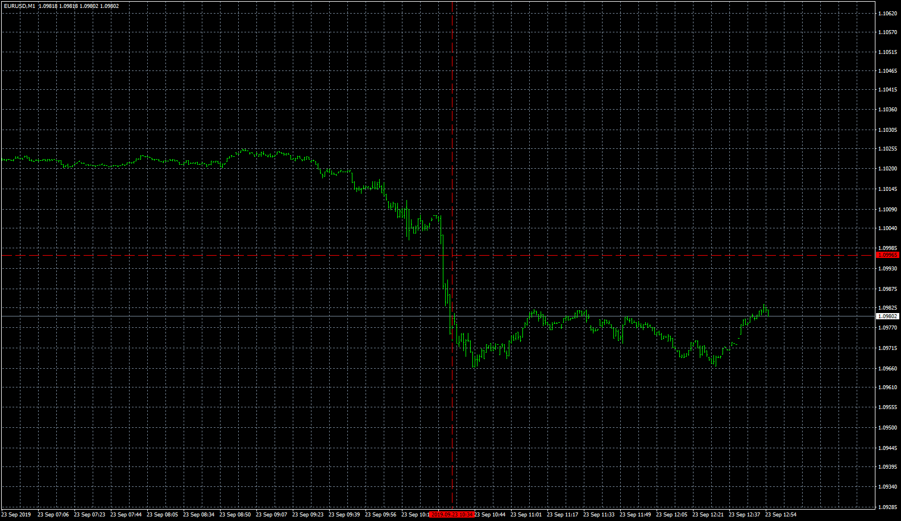
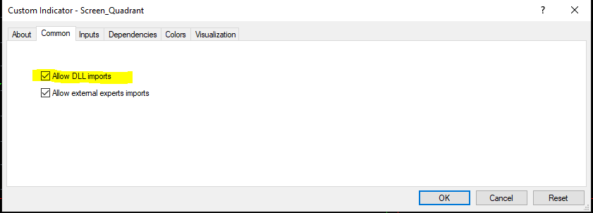

# Screen_Quadrant

> Source: https://fxcodebase.com/code/viewtopic.php?f=38&t=68997  
> Forum: 38 · Topic 68997 · 2 post(s)

---

## Screen_Quadrant

**Apprentice** · Wed Oct 09, 2019 1:20 pm

Make sure to allow dll-s.

 

Based on request.
[viewtopic.php?f=27&t=65153](https://fxcodebase.com/code/viewtopic.php?f=27&t=65153)

 [Screen_Quadrant.mq4](files/129072/Screen_Quadrant.mq4)

---

## Re: Screen_Quadrant

**BadTunaSalad** · Sun Oct 13, 2019 9:36 pm

This will work nicely! Thank you very much for your time and effort.

BTS
