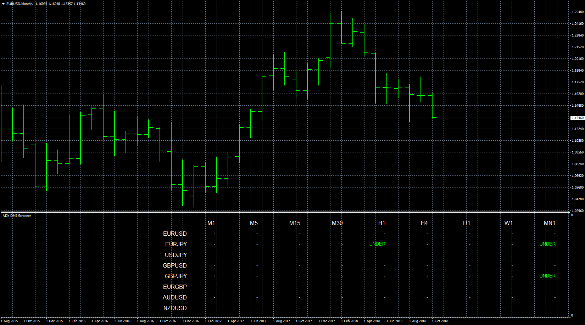

# SCREENER ADX DMI

> Source: https://fxcodebase.com/code/viewtopic.php?f=38&t=66875  
> Forum: 38 · Topic 66875 · 7 post(s)

---

## SCREENER ADX DMI

**Apprentice** · Tue Oct 30, 2018 5:15 pm

Based on request.
[viewtopic.php?f=27&t=66865](https://fxcodebase.com/code/viewtopic.php?f=27&t=66865)
Open Long when DI + and ADX cross Level set by user
Close Long when the DI- has a positive slope.
Open Short when DI - and ADX cross Level set by user
Close Short when the DI+ has a positive slope.

 [SCREENER ADX DMI.mq4](files/121878/SCREENER%20ADX%20DMI.mq4)

 [ADX DMI EA.mq4](files/121878/ADX%20DMI%20EA.mq4)

---

## Re: SCREENER ADX DMI

**gilda22** · Wed Oct 31, 2018 1:51 pm

Thank you very much Appendice

I didn't dare ask you for anything anymore because I was embarrassed to give you a job like that

I'm going to take a closer look now.

THANK YOU very much

---

## Re: SCREENER ADX DMI

**Apprentice** · Fri Nov 02, 2018 12:34 pm

It's not a problem, consider one of the donation options.

---

## Re: SCREENER ADX DMI

**gilda22** · Mon Nov 05, 2018 6:34 pm

Good evening Apprentice

I would like to ask you again if you could create another EA for me based on what you have already done.

This is an EA that would be triggered on the DED (I attach the file) PURCHASE BLUE SALE YELLOW
2 ADX + DI + DI + or DI- curves outputs of line 20

I attach a doc word with explanations

THANK YOU for looking at this if you agree.

It's better to contact me on [[email protected]](https://fxcodebase.com/cdn-cgi/l/email-protection#f19590839296989db186909f90959e9edf9783) to avoid google machine translation problems

---

## Re: SCREENER ADX DMI

**Apprentice** · Tue Nov 06, 2018 6:09 am

Your request is added to the development list under Id Number 4301

---

## Re: SCREENER ADX DMI

**gilda22** · Tue Nov 06, 2018 10:10 am

> **Apprentice wrote:**
> Your request is added to the development list under Id Number 4301

Top Thank's

---

## Re: SCREENER ADX DMI

**Apprentice** · Thu Nov 08, 2018 4:05 pm

It looks like ADX Color.ex4 is corrupted and cannot be loaded.
Is ADX simple ADX / DI+/DI- indicator?
If NOT, Can you provide a version that works or mq4 version
or screenshot + detail description.
