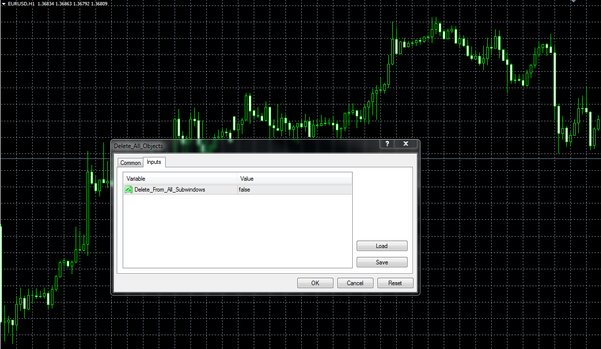

# Script to remove objects from the chart

> Source: https://fxcodebase.com/code/viewtopic.php?f=38&t=60360  
> Forum: 38 · Topic 60360 · 1 post(s)

---

## Script to remove objects from the chart

**Alexander.Gettinger** · Thu Feb 27, 2014 10:22 am

The script removes the objects from the main window or all windows.

 

Download:

 [Delete_All_Objects.mq4](files/92921/Delete_All_Objects.mq4)
