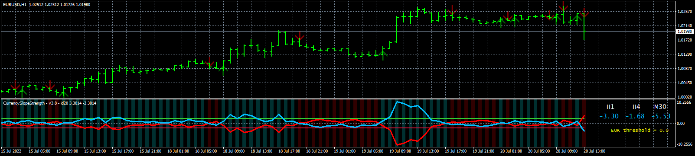

# SCSS_EA

> Source: https://fxcodebase.com/code/viewtopic.php?f=38&t=72535  
> Forum: 38 · Topic 72535 · 2 post(s)

---

## SCSS_EA

**Apprentice** · Wed Jul 20, 2022 6:05 am

Based on the request.
[https://fxcodebase.com/code/viewtopic.php?f=38&t=72520](https://fxcodebase.com/code/viewtopic.php?f=38&t=72520)
To work the indicator must be attached to the chart

 [SCSS.mq4](files/146811/SCSS.mq4)

 [SCSS_EA.mq4](files/146811/SCSS_EA.mq4)

---

## Re: SCSS_EA

**makomajor** · Sun Jul 31, 2022 1:31 pm

Dear Coders,

 Thank you.

Makomajor
