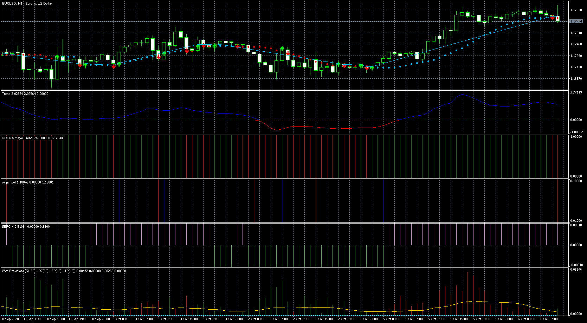

# SEFC X

> Source: https://fxcodebase.com/code/viewtopic.php?f=38&t=70512  
> Forum: 38 · Topic 70512 · 6 post(s)

---

## SEFC X

**Apprentice** · Tue Oct 06, 2020 2:46 am

Based on request.
[viewtopic.php?f=27&t=70250](https://fxcodebase.com/code/viewtopic.php?f=27&t=70250)

 [SEFC X.mq5](files/138091/SEFC%20X.mq5)

---

## !MT4 TREND

**Apprentice** · Tue Oct 06, 2020 2:47 am

[!MT4 TREND.mq5](files/138092/MT4%20TREND.mq5)

---

## WAExplosion

**Apprentice** · Tue Oct 06, 2020 2:48 am

[WAExplosion.mq5](files/138093/WAExplosion.mq5)

---

## DDFX_4_MajorTrend_v4

**Apprentice** · Tue Oct 06, 2020 2:48 am

[DDFX_4_MajorTrend_v4.mq5](files/138094/DDFX_4_MajorTrend_v4.mq5)

---

## ivjempol-histogram

**Apprentice** · Tue Oct 06, 2020 2:49 am

[ivjempol-histogram.mq5](files/138095/ivjempol-histogram.mq5)

---

## indicator02

**Apprentice** · Tue Oct 06, 2020 2:49 am

[indicator02.mq5](files/138096/indicator02.mq5)
