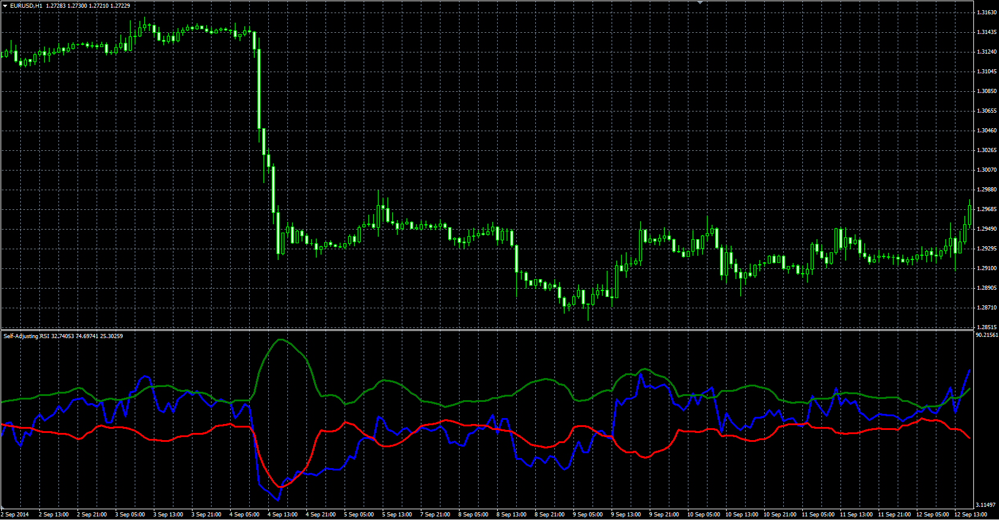

# Self-Adjusting RSI

> Source: https://fxcodebase.com/code/viewtopic.php?f=38&t=61390  
> Forum: 38 · Topic 61390 · 1 post(s)

---

## Self-Adjusting RSI

**Alexander.Gettinger** · Mon Oct 27, 2014 11:07 am

Original LUA oscillator: [viewtopic.php?f=17&t=23532](https://fxcodebase.com/code/viewtopic.php?f=17&t=23532).

> David Sepiashvili’s article, “The Self-Adjusting RSI,” describes two methods of adjusting the width of the overbought and oversold bands for the RSI.

 

Download:

 [Self_Adjusting_RSI.mq4](files/96769/Self_Adjusting_RSI.mq4)
