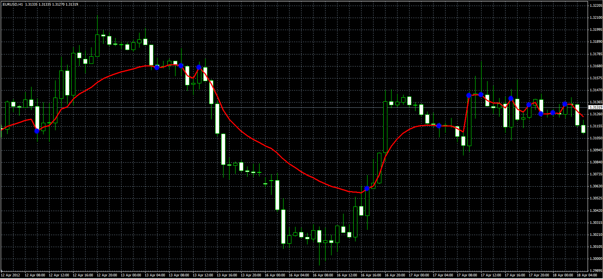
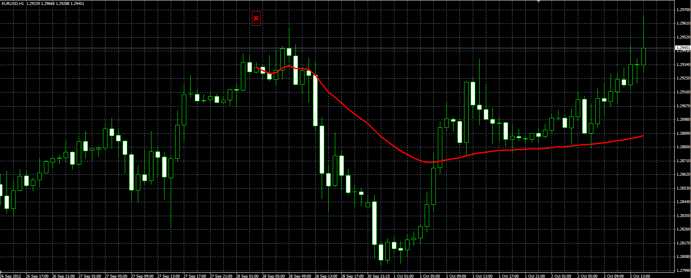
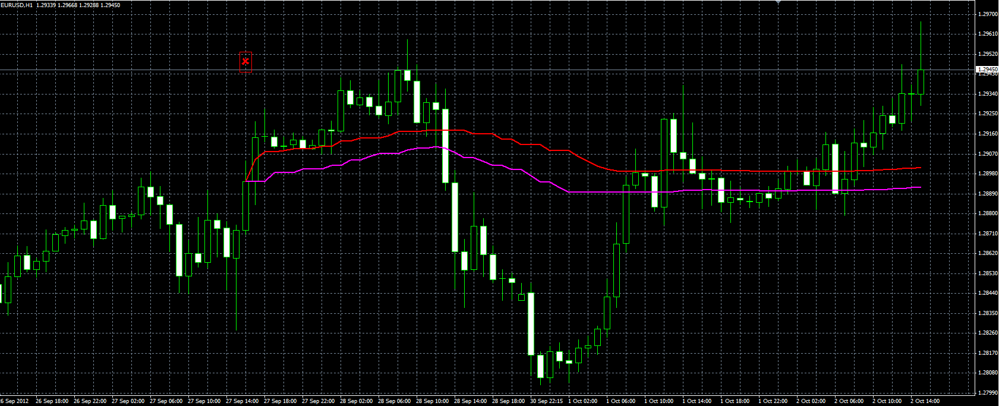

# Serial moving average

> Source: https://fxcodebase.com/code/viewtopic.php?f=38&t=16426  
> Forum: 38 · Topic 16426 · 7 post(s)

---

## Serial moving average

**Alexander.Gettinger** · Thu Apr 19, 2012 2:20 pm

Original indicator: [viewtopic.php?f=17&t=15886](https://fxcodebase.com/code/viewtopic.php?f=17&t=15886)

> Simple moving average with a variable (increasing) period.
> The period resets in the points of intersection of price and MA.

 

Download:

 [SerialMA.mq4](files/30538/SerialMA.mq4)

---

## Re: Serial moving average

**philname** · Fri Sep 07, 2012 5:56 am

I search the version of mt4 for this sérial indicator with a stating point :

[viewtopic.php?f=17&t=15886#p29824](https://fxcodebase.com/code/viewtopic.php?f=17&t=15886#p29824)

---

## Re: Serial moving average

**Alexander.Gettinger** · Fri Sep 07, 2012 11:25 am

I'll write it.

---

## Re: Serial moving average

**philname** · Sat Sep 08, 2012 4:50 pm

ANd i searche a :
EWMA - pour Exponential Weighted Moving Average.

TO test something, i never fund this MA !

---

## Re: Serial moving average

**Alexander.Gettinger** · Tue Oct 02, 2012 10:53 am

Serial MA with user-defined starting point.
The starting point is determined by the cross.
Starting from the initial point, the period of MA will be increased by 1 on each bar.

 

Download:

 [SerialMA2.mq4](files/41288/SerialMA2.mq4)

---

## Re: Serial moving average

**Alexander.Gettinger** · Tue Oct 02, 2012 10:53 am

Indicator with user-defined starting point and separate summing for UP (Close>Open) and DN (Close<Open) candles.

 

Download:

 [SerialMA3.mq4](files/41289/SerialMA3.mq4)

---

## Re: Serial moving average

**philname** · Sun Oct 28, 2012 11:35 pm

This work great !

Thanks !

But when there be a lot of bars, it need a lot of cpu .
