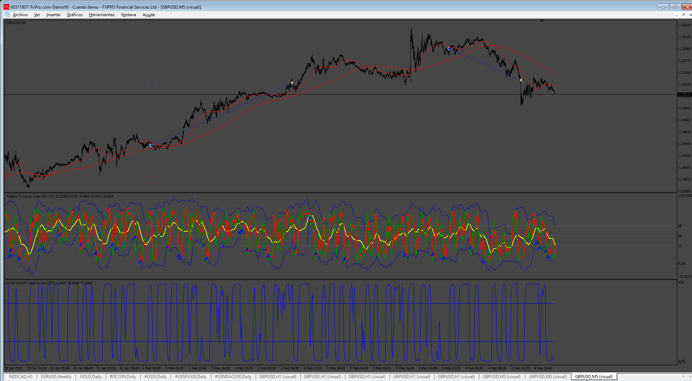

# SET_EA

> Source: https://fxcodebase.com/code/viewtopic.php?f=38&t=75573  
> Forum: 38 · Topic 75573 · 4 post(s)

---

## SET_EA

**Apprentice** · Wed Feb 05, 2025 2:23 pm

Based on the request.
[https://fxcodebase.com/code/viewtopic.php?f=31&p=142710](https://fxcodebase.com/code/viewtopic.php?f=31&p=142710)

Uses
[viewtopic.php?f=38&t=70751](https://fxcodebase.com/code/viewtopic.php?f=38&t=70751)
and
[viewtopic.php?f=38&t=74157](https://fxcodebase.com/code/viewtopic.php?f=38&t=74157)

 [SET_EA.mq4](files/158112/SET_EA.mq4)

---

## Re: SET_EA

**darvo77** · Wed Feb 26, 2025 12:02 am

Can you include indicators in the EA? Now it is impossible to test in mt4.

---

## Re: SET_EA

**Apprentice** · Tue Mar 04, 2025 5:45 am

We have added your request to the development list.
Development reference 158

---

## Re: SET_EA

**Apprentice** · Mon Mar 10, 2025 1:39 pm

 [SET_EA_with_indicators.ex4](files/158545/SET_EA_with_indicators.ex4)

 [SET_EA_with_indicators.mq4](files/158545/SET_EA_with_indicators.mq4)
