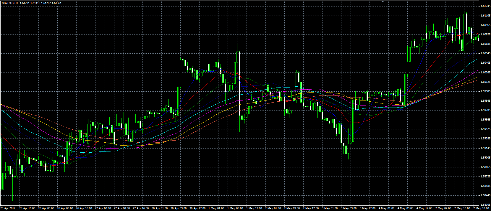

# Set of averages

> Source: https://fxcodebase.com/code/viewtopic.php?f=38&t=17984  
> Forum: 38 · Topic 17984 · 1 post(s)

---

## Set of averages

**Alexander.Gettinger** · Tue May 08, 2012 5:15 pm

Original indicator: [viewtopic.php?f=17&t=9568&p=26451](https://fxcodebase.com/code/viewtopic.php?f=17&t=9568&p=26451)

> The indicator draws a set of averages. Periods are entered as a string. Characters other than numbers are perceived as a separator.

Unfortunately, the MT4 can not display more than 8 indicator buffers.

 

Download:

 [Set_Of_Averages.mq4](files/32539/Set_Of_Averages.mq4)
