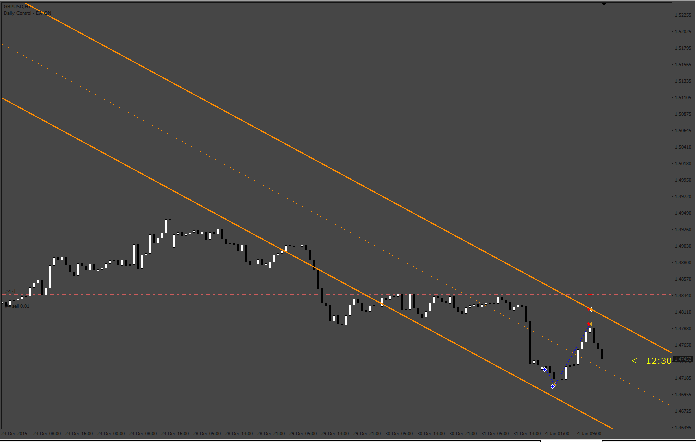
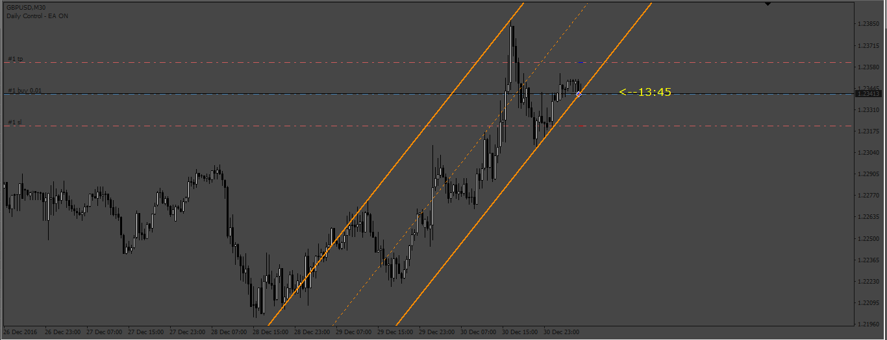
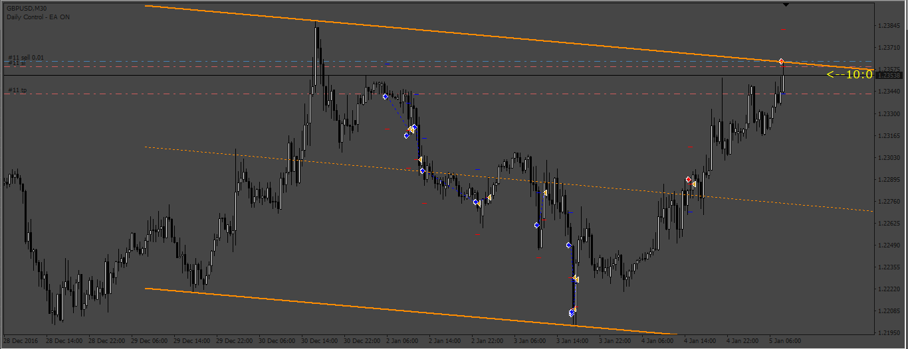

# SF_TL-Indicator EA

> Source: https://fxcodebase.com/code/viewtopic.php?f=38&t=73248  
> Forum: 38 · Topic 73248 · 4 post(s)

---

## SF_TL-Indicator EA

**Apprentice** · Fri Jan 20, 2023 10:58 am

Based on the request.
[https://fxcodebase.com/code/viewtopic.php?f=27&p=149067](https://fxcodebase.com/code/viewtopic.php?f=27&p=149067)

 [SF_TL-Indicator.mq4](files/149185/SF_TL-Indicator.mq4)

 [SF_TL-Indicator EA.mq4](files/149185/SF_TL-Indicator%20EA.mq4)

---

## Re: SF_TL-Indicator EA

**Sensible** · Thu Jan 26, 2023 4:48 am

Hello Apprentice and Team of FxcodeBase,

I really appreciate the Job done and effort to put this SF_TL-Indicator EA together.

I have issues with it.

First after installing it to Mt4 platform and to put it to take a trade on Demo account it prompted me with popup alert to: Please, Install the SF_TL-indicator.ex4 indicator

and again when I run it on Strategy Tester it not taking any trade.

Secondly, In the Input parameter setting this is missing from BreakEven:

-Breakeven with Steps( it very important to be include)

 Thanks looking forward to these corrections.

---

## Re: SF_TL-Indicator EA

**Apprentice** · Thu Jan 26, 2023 5:42 am

We have added your request to the development list.
Development reference 84.

---

## Re: SF_TL-Indicator EA

**Apprentice** · Wed Feb 01, 2023 2:07 pm

 

Make sure to install the SF_TL-Indicator.mq4.

 [SF_TL-Indicator_EA_v2.mq4](files/149444/SF_TL-Indicator_EA_v2.mq4)
