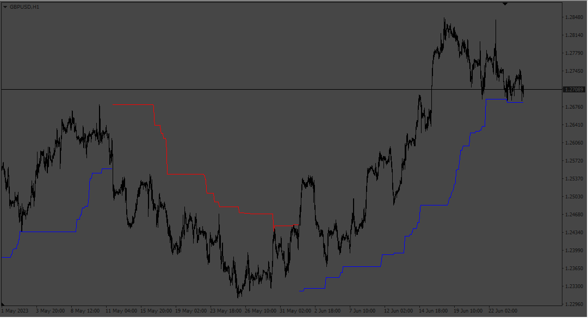
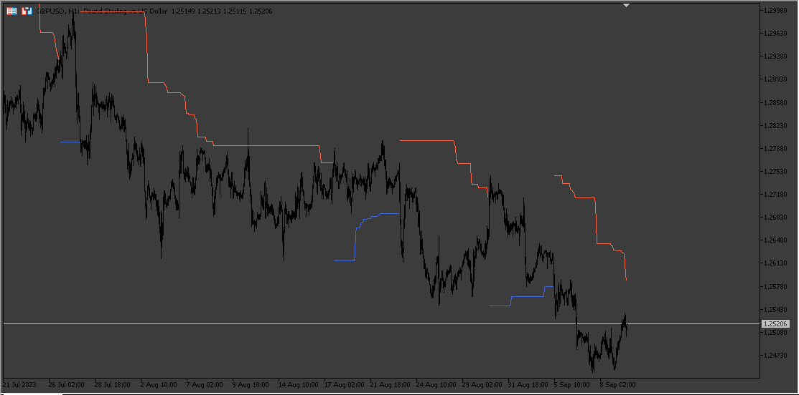

# Sherif_Hilo

> Source: https://fxcodebase.com/code/viewtopic.php?f=38&t=73873  
> Forum: 38 · Topic 73873 · 9 post(s)

---

## Sherif_Hilo

**Apprentice** · Mon Jun 26, 2023 3:21 pm

Based on the request.
[https://fxcodebase.com/code/viewtopic.php?f=27&p=151138](https://fxcodebase.com/code/viewtopic.php?f=27&p=151138)

 [Sherif_Hilo.mq4](files/151425/Sherif_Hilo.mq4)

 

 [Sherif_Hilo_MT5.mq5](files/151425/Sherif_Hilo_MT5.mq5)

TS2 version
[https://fxcodebase.com/code/viewtopic.php?f=17&t=73905](https://fxcodebase.com/code/viewtopic.php?f=17&t=73905)

---

## Re: Sherif_Hilo

**xristos1982** · Wed Jun 28, 2023 3:00 pm

Can i have this in Lua please?

---

## Re: Sherif_Hilo

**Apprentice** · Sat Jul 01, 2023 6:02 am

We have added your request to the development list.
Development reference 571.

---

## Re: Sherif_Hilo

**Apprentice** · Sat Jul 08, 2023 2:06 pm

TS2 version
[https://fxcodebase.com/code/viewtopic.php?f=17&t=73905](https://fxcodebase.com/code/viewtopic.php?f=17&t=73905)

---

## Re: Sherif_Hilo

**Hfx 2023** · Sun Jul 09, 2023 10:48 am

Hello
Please add the tradingview version as well !

Tnx

---

## Re: Sherif_Hilo

**Apprentice** · Mon Jul 10, 2023 5:28 am

Unfortunately, we do not provide Tradingview support.

---

## Re: Sherif_Hilo

**123jevis** · Thu Sep 07, 2023 3:18 am

Hello,

could you please provide the .mt5 version as well. thanks in advance

---

## Re: Sherif_Hilo

**Apprentice** · Sun Sep 10, 2023 2:47 pm

We have added your request to the development list.
Development reference 823.

---

## Re: Sherif_Hilo

**Apprentice** · Sat Sep 16, 2023 4:36 am

MT5 version added.
