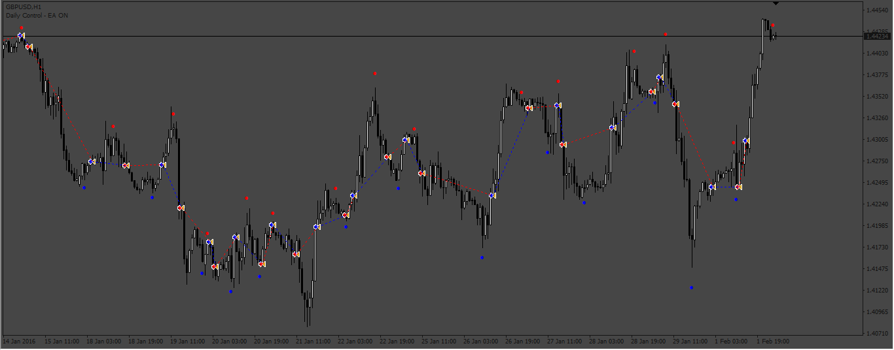
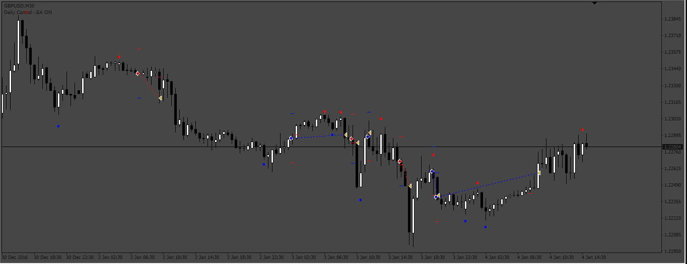
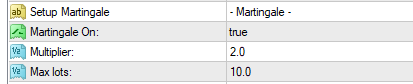

# Shi_SilverTrendSig_EA

> Source: https://fxcodebase.com/code/viewtopic.php?f=38&t=73264  
> Forum: 38 · Topic 73264 · 16 post(s)

---

## Shi_SilverTrendSig_EA

**Apprentice** · Mon Jan 23, 2023 10:32 am

Based on the request.
[https://fxcodebase.com/code/viewtopic.php?f=27&p=149168](https://fxcodebase.com/code/viewtopic.php?f=27&p=149168)

 [Shi_SilverTrendSig_EA.mq4](files/149253/Shi_SilverTrendSig_EA.mq4)

 [Shi_SilverTrendSig-Indicator.mq4](files/149253/Shi_SilverTrendSig-Indicator.mq4)

---

## Re: Shi_SilverTrendSig_EA

**swordfish304** · Thu Jan 26, 2023 12:16 am

Hi Apprentice,

Hope you are doing good.

I would like to ask if you can include this as an option to this ea.

Use Martingale = Yes or No (for martingale there will be no several open order, once the order hit the stop loss, the new order will multiply the lot multiplier to the lot size, once it hit the Take Profit it will go back to original lot size. So there will be one order only at a time.)
Lot Multiplier = 2
Max steps = 10

Regards,

Swordfish

---

## Re: Shi_SilverTrendSig_EA

**Sensible** · Thu Jan 26, 2023 5:05 am

Hello Apprentice and Team of FxcodeBase,

I really appreciate the Job done and effort to put this Shi_SilverTrendSig_EA together.

It working according to strategy plan but I have one issue with it.

In the Input parameter setting this is missing from BreakEven:

-Breakeven with Steps( it very important to be include)

 Thanks looking forward to the correction of including breakeven with steps.

---

## Re: Shi_SilverTrendSig_EA

**Apprentice** · Thu Jan 26, 2023 5:36 am

We have added your request to the development list.
Development reference 83.

---

## Re: Shi_SilverTrendSig_EA

**Sensible** · Thu Jan 26, 2023 9:13 am

Hi Apprentice,

I will counter my early post reason is that I only run it on the strategy tester without visual mode but when I saw the result given against my expectation I have to use visual mode strategy tester and also the Demo live account to observe how it taking a trade.

my observation is this with Shi_SilverTrendSig_EA, why the use of 20EMA crossover which is against my strategy of take a Buy trade when Blue Dot indicator appear below Price and Take a Sell trade when Red Dot indicator appear above price. Please help me to correct this to take a trade on dot signal indicator and not 20EMA cross above or below.

Pls, can you also help me to fixed this on the Shi_SilverTrendSig_indicator I observe that the indicator doesn't print on the chant, I have to remove and place it back before it shows on chart.

Thanks alot

---

## Re: Shi_SilverTrendSig_EA

**Sensible** · Wed Feb 01, 2023 8:17 am

Good day Apprentice,

Hope they are working on it by removing trading strategy of using 20EMA cross above and below and allow it to take a trade base on arrow signal.

Thanks looking forward to the correction.

---

## Re: Shi_SilverTrendSig_EA

**Apprentice** · Wed Feb 01, 2023 2:10 pm

 

Make sure to install the Shi_SilverTrendSig-Indicator.mq4

 [Shi_SilverTrendSig_EA_v2.mq4](files/149445/Shi_SilverTrendSig_EA_v2.mq4)

---

## Re: Shi_SilverTrendSig_EA

**swordfish304** · Thu Feb 02, 2023 4:21 am

> **Apprentice wrote:**
>
>
> 83pic_Martingale_and_BreackevenStep.png
>
>
>
>
> 83pic_Maritingale_Inputs.png
>
>
> Make sure to install the Shi_SilverTrendSig-Indicator.mq4
>
>
> Shi_SilverTrendSig_EA_v2.mq4

Thanks a lot Apprentice.

---

## Re: Shi_SilverTrendSig_EA

**Sensible** · Thu Feb 02, 2023 7:29 am

> **Sensible wrote:**
> Good day Apprentice,
>
> Hope they are working on it by removing trading strategy of using 20EMA cross above and below and allow it to take a trade base on arrow signal.
>
> Thanks looking forward to the correction.

want to know if my correction has being work on. i.e making it to take trade base on Dot signal and not 20EMA

---

## Re: Shi_SilverTrendSig_EA

**Sensible** · Thu Feb 02, 2023 7:33 am

> **Sensible wrote:**
> Good day Apprentice,
>
> Hope they are working on it by removing trading strategy of using 20EMA cross above and below and allow it to take a trade base on arrow signal.
>
> Thanks looking forward to the correction.

want to know if my correction has being work on. i.e making it to take trade base on Dot signal and not 20EMA

Because from my observation from the second diagram I see that it taking trade on 20EMA cross above and below.

---

## Re: Shi_SilverTrendSig_EA

**Sensible** · Thu Feb 02, 2023 8:08 am

Hi Apprentice,

So sorry for the multiple post.

I have to redownload and comfirm it, if it is done and I have seen that the 20EMA has been removed from the Shi_SilverTrendSig_EA Input parameter Thanks for that.

Here is another Observation while testing it in Mt4 Strategy Tester. I observe that there is delay in EA taking an open buy or sell after 3 or 4 candlestick after the Dot signal appear. by the time it open the next dot signal has appear and it leading to losses.

Please Sir, help me to correct it to take trade immediately the dot signal appear not after 3 or 4 candlestick.

I will appreciate it if the dot signal for sell or buy correspond with EA opening trade. i.e tally with the signal of the indicator.

Thanks alot looking forward to this correction.

---

## Re: Shi_SilverTrendSig_EA

**swordfish304** · Thu Feb 02, 2023 11:37 am

Hi Apprentice,

I'm doing forward testing, I just notice that sometimes the trade close prematurely, it does not hit the TP, that's why it's resulting negative when martingale is on, other than that for me it's perfect.

Thanks for your hard work.

Regards,

Swordfish

---

## Re: Shi_SilverTrendSig_EA

**Apprentice** · Sun Feb 05, 2023 4:31 am

We have added your request to the development list.
Development reference 126.

---

## Re: Shi_SilverTrendSig_EA

**Sensible** · Sun Feb 05, 2023 8:23 pm

Thanks alot,

Hope swordfish304 request is not going to conflict with my correction.

Please, Identify and deal with it separately.

---

## Re: Shi_SilverTrendSig_EA

**Apprentice** · Fri Feb 10, 2023 8:24 am

Try this version.

 [Shi_SilverTrendSig_EA_v3.mq4](files/149590/Shi_SilverTrendSig_EA_v3.mq4)

---

## Re: Shi_SilverTrendSig_EA

**swordfish304** · Mon Feb 13, 2023 10:59 pm

> **Apprentice wrote:**
> Try this version.
>
>
> Shi_SilverTrendSig_EA_v3.mq4

Hi Apprentice,

Thanks a lot, I'm doing forward testing, for now I didn't see any premature TP, let see for one week and report back here if it is still the same.

Regards.

Swordfish304
