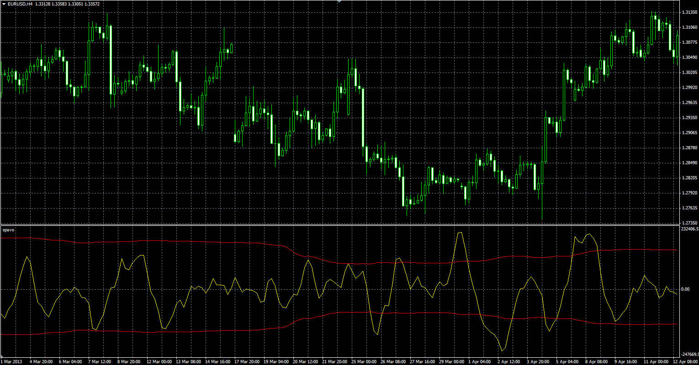

# Short-term Volume and Price Oscillator

> Source: https://fxcodebase.com/code/viewtopic.php?f=38&t=41312  
> Forum: 38 · Topic 41312 · 1 post(s)

---

## Short-term Volume and Price Oscillator

**Alexander.Gettinger** · Tue Jun 18, 2013 2:57 pm

Original oscillator: [viewtopic.php?f=17&t=15080&p=28557](https://fxcodebase.com/code/viewtopic.php?f=17&t=15080&p=28557)

 

Download:

 [spavo.mq4](files/67540/spavo.mq4)

For this indicator must be installed HA_EMA3 indicator ([viewtopic.php?f=38&t=41310](https://fxcodebase.com/code/viewtopic.php?f=38&t=41310)).
