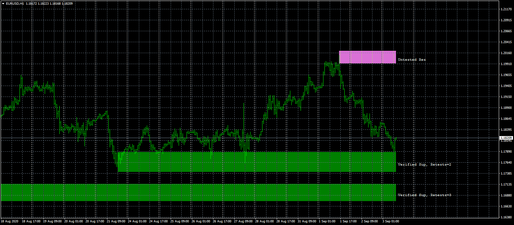

# shved_supply_and_demand

> Source: https://fxcodebase.com/code/viewtopic.php?f=38&t=70371  
> Forum: 38 · Topic 70371 · 16 post(s)

---

## shved_supply_and_demand

**Apprentice** · Thu Sep 03, 2020 3:01 am

Based on request.
[viewtopic.php?f=27&t=70353](https://fxcodebase.com/code/viewtopic.php?f=27&t=70353)

 [shved_supply_and_demand.mq4](files/137278/shved_supply_and_demand.mq4)

---

## Re: shved_supply_and_demand

**foxytrader** · Fri Jan 08, 2021 8:45 pm

Hi Apprentice,

This indicator is quite useful & it can help to quickly identify strong areas on the charts but sometimes it's too much, possible to add a hide/show button to this indicator to make the chart cleaner?

Thanks

---

## Re: shved_supply_and_demand

**Apprentice** · Sun Jan 10, 2021 2:14 am

Your request is added to the development list.
Development reference 56.

---

## Re: shved_supply_and_demand

**Apprentice** · Tue Jan 12, 2021 10:06 am

[shved_supply_and_demand.mq4](files/140174/shved_supply_and_demand.mq4)

Try this version.

---

## Re: shved_supply_and_demand

**foxytrader** · Mon Jan 18, 2021 9:35 pm

Thanks a lot apprentice.

---

## Re: shved_supply_and_demand

**AndrewOcconer** · Fri Feb 26, 2021 8:11 pm

Hi Apprentice, Can you add arrows with buffers when the price touches the zones?
Thank you

---

## Re: shved_supply_and_demand

**Apprentice** · Sat Feb 27, 2021 4:07 am

Your request is added to the development list.
Development reference 233.

---

## Re: shved_supply_and_demand

**Apprentice** · Wed Mar 03, 2021 1:19 pm

[shved_supply_and_demand.mq4](files/141018/shved_supply_and_demand.mq4)

Try this version.

---

## Re: shved_supply_and_demand

**logicgate** · Thu Mar 04, 2021 5:31 am

Hi there dear friend Apprentice, can we get a version for MT5?

---

## Re: shved_supply_and_demand

**Apprentice** · Thu Mar 04, 2021 12:17 pm

Your request is added to the development list.
Development reference 251.

---

## Re: shved_supply_and_demand

**tsholo13** · Thu Oct 14, 2021 6:49 am

Hi
Can you make chart Dashboard/Scanner when the price touches the zones gives an alert..especially verified and proven zones

---

## Re: shved_supply_and_demand

**Apprentice** · Sat Oct 16, 2021 5:35 am

Your request is added to the development list.
Development reference 916.

---

## Re: shved_supply_and_demand

**tsholo13** · Wed Nov 03, 2021 3:30 am

Why is this taking long?

---

## Re: shved_supply_and_demand

**Apprentice** · Wed Nov 03, 2021 10:37 am

Due to staff, budget limitation.

---

## Re: shved_supply_and_demand

**Fiki Hafana** · Mon Nov 15, 2021 2:53 pm

> **Apprentice wrote:**
> Due to staff, budget limitation.

Can you inform me your max budget to do this task by PM? i can create for him

thank you

---

## Re: shved_supply_and_demand

**tsholo13** · Tue Nov 16, 2021 1:25 am

Its been far too long now can we have the scanner already please
