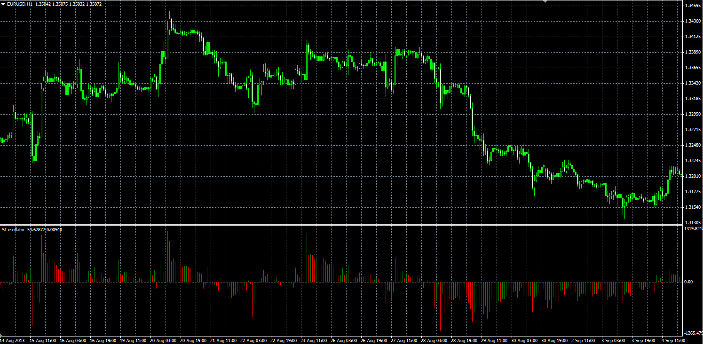

# SI oscillator

> Source: https://fxcodebase.com/code/viewtopic.php?f=38&t=59975  
> Forum: 38 · Topic 59975 · 1 post(s)

---

## SI oscillator

**Alexander.Gettinger** · Mon Nov 25, 2013 5:16 pm

Original LUA oscillator: [viewtopic.php?f=17&t=59974](https://fxcodebase.com/code/viewtopic.php?f=17&t=59974).

 

Download:

 [SI.mq4](files/91112/SI.mq4)
