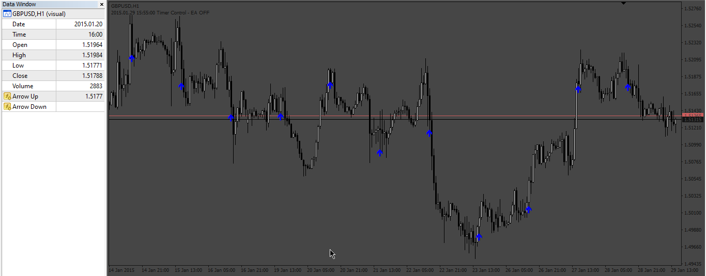
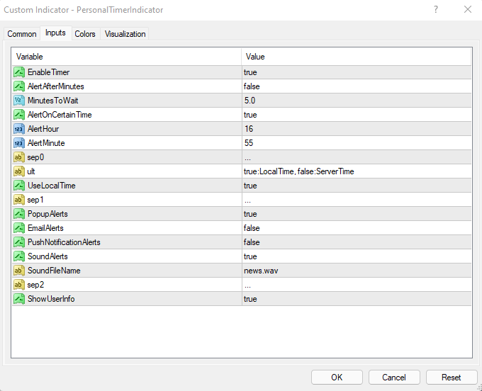
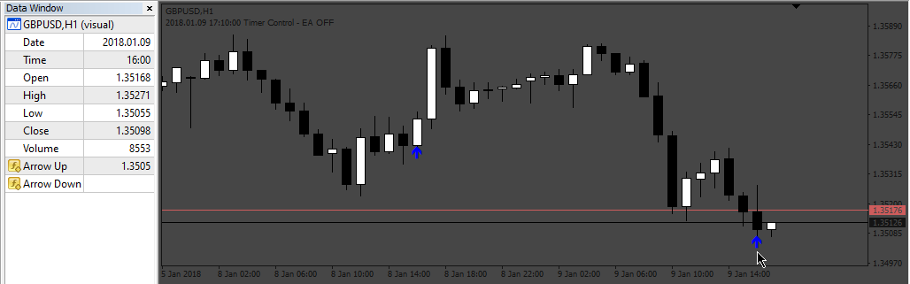

# Signals_in_Time_Indicator

> Source: https://fxcodebase.com/code/viewtopic.php?f=38&t=73818  
> Forum: 38 · Topic 73818 · 4 post(s)

---

## Signals_in_Time_Indicator

**Apprentice** · Mon Jun 12, 2023 2:51 pm

 

Based on the request.
[https://fxcodebase.com/code/viewtopic.php?f=27&t=73784](https://fxcodebase.com/code/viewtopic.php?f=27&t=73784)

 [PersonalTimerIndicator.ex4](files/151194/PersonalTimerIndicator.ex4)

 [Signals_in_Time_Indicator.mq4](files/151194/Signals_in_Time_Indicator.mq4)

---

## Re: Signals_in_Time_Indicator

**Boillingpoint2022** · Wed Jun 14, 2023 7:42 am

Apprentice sir,

I have spent three days testing the indicator. i really appreciate its development, it works perfect except for this one 'glitch'. It seems the arrows are not tied to the buffers, and they are not graphic objects either, so the EA's cannot detect them.

-i have tested with different EA's, including those working with graphic arrows but with no response.
-i have also tested with different 'adapter indicators' which I normaly use to detect any object, colour or text on the chart but without success.

Will most appreciate modifications of any kind just to detect the arrows; graphical or non-graphical.

Regards

---

## Re: Signals_in_Time_Indicator

**Apprentice** · Thu Jun 15, 2023 5:01 am

We have added your request to the development list.
Development reference 513.

---

## Re: Signals_in_Time_Indicator

**Apprentice** · Tue Jun 20, 2023 12:31 pm

 

The buffers to the signals are:
Buy Buffer: 0
Sell Buffer: 1
In this EA I make an example that how you can use a code to take the signals from the indicator

 [Signals_in_Time_Indicator.mq4](files/151306/Signals_in_Time_Indicator.mq4)

 [Signals_In_Time_EA.mq4](files/151306/Signals_In_Time_EA.mq4)
