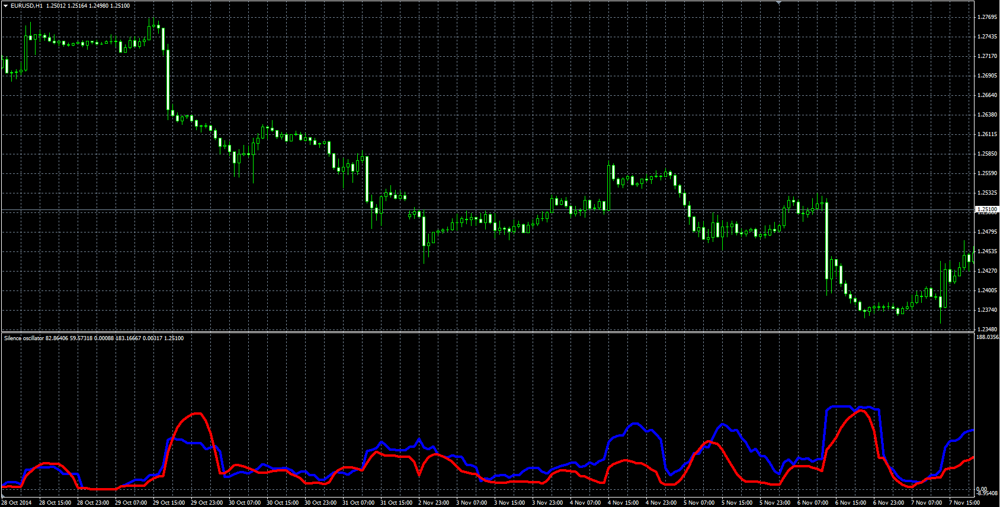

# Silence oscillator

> Source: https://fxcodebase.com/code/viewtopic.php?f=38&t=61613  
> Forum: 38 · Topic 61613 · 1 post(s)

---

## Silence oscillator

**Alexander.Gettinger** · Fri Dec 19, 2014 3:24 pm

The indicator shows aggressiveness (velocity of price change, blue line) and volatility (red line).
Volatility corresponds to StdDev indicator.

 

Download:

 [Silence.mq4](files/97782/Silence.mq4)
