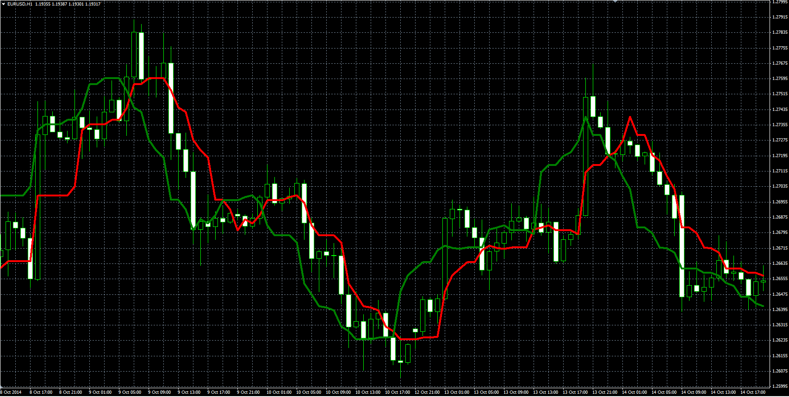

# Silver Trend indicator

> Source: https://fxcodebase.com/code/viewtopic.php?f=38&t=61687  
> Forum: 38 · Topic 61687 · 4 post(s)

---

## Silver Trend indicator

**Alexander.Gettinger** · Thu Jan 08, 2015 4:49 pm

Original LUA indicator: [viewtopic.php?f=17&t=2060](https://fxcodebase.com/code/viewtopic.php?f=17&t=2060).

Formulas:
S1[i] = smax,
S2[i-SSP] = smax, where
smax = Max-(Max-Min)*K/100,
Max, Min - maximum and minimum prices at range from (i-SSP+1) to (i).

 

Download:

 [Silver_Trend.mq4](files/98046/Silver_Trend.mq4)

---

## Re: Silver Trend indicator

**beyourself** · Sun Feb 16, 2025 8:58 am

hello.
plz can you make it as ea? without sl and tp; it works according to the cross of these 2 moving average.. thank you

---

## Re: Silver Trend indicator

**Apprentice** · Mon Feb 17, 2025 1:14 pm

We have added your request to the development list.
Development reference 116

---

## Re: Silver Trend indicator

**Apprentice** · Wed Feb 19, 2025 4:19 am

 [Silver_Trend_ea.mq4](files/158301/Silver_Trend_ea.mq4)
