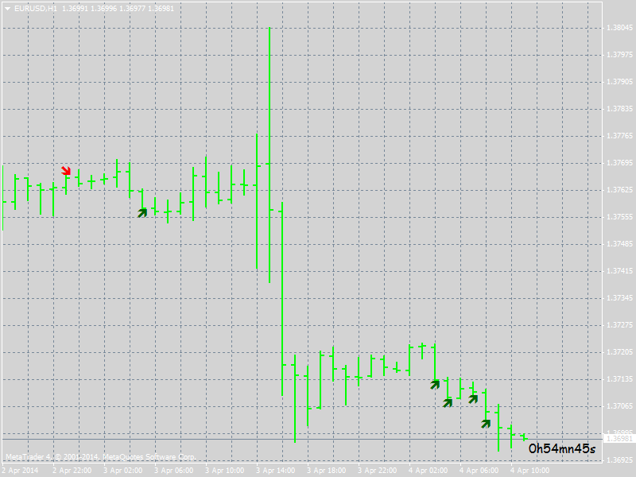

# Simple and effective strategy for Binary Option

> Source: https://fxcodebase.com/code/viewtopic.php?f=38&t=60497  
> Forum: 38 · Topic 60497 · 2 post(s)

---

## Simple and effective strategy for Binary Option

**kenoxpc** · Tue Apr 01, 2014 4:38 am

 [KENOX Binary Indicator V3.mq4](files/93321/KENOX%20Binary%20Indicator%20V3.mq4)

After a serious a long time to learn how MQL4 i just want to share my first Binary Option Indicator Based on OSMA and William Percent Range.
When a red arrow is given go to PUT for 3 periods.
When a blue arrow is given go to CALLfor 3 periods.
When a red star is given thats mean Weakening UpTrend
When a bkue star is given thats mean Weakening DownTrend

Thank you.

---

## Re: Simple and effective strategy for Binary Option

**kenoxpc** · Thu Apr 03, 2014 9:01 am

Here there is a new version of my Binary Option Indicator

 [KENOX Binary Indicator .mq4](files/93343/KENOX%20Binary%20Indicator%20.mq4)
