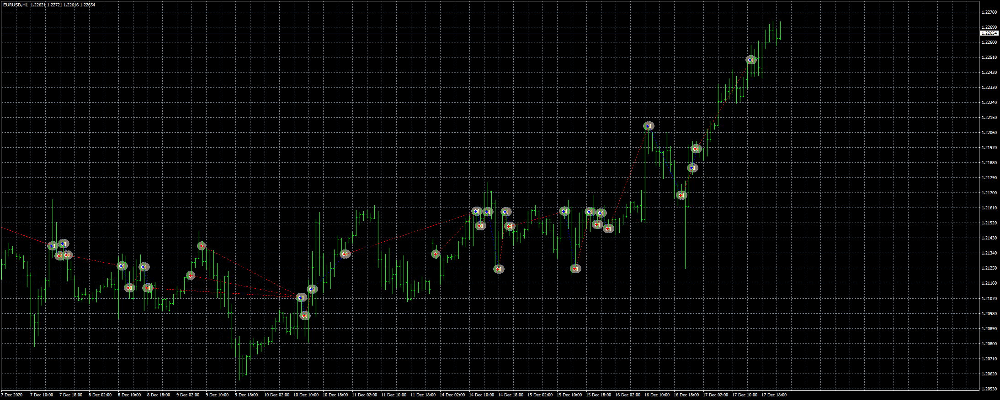

# Simple breakout strategy EA

> Source: https://fxcodebase.com/code/viewtopic.php?f=38&t=70867  
> Forum: 38 · Topic 70867 · 6 post(s)

---

## Simple breakout strategy EA

**Apprentice** · Sat Jan 30, 2021 6:34 am

Based on the request.
[viewtopic.php?f=27&t=70839](https://fxcodebase.com/code/viewtopic.php?f=27&t=70839)

 [Simple breakout strategy EA.mq4](files/140432/Simple%20breakout%20strategy%20EA.mq4)

---

## Re: Simple breakout strategy EA

**Elridge** · Fri Feb 05, 2021 10:53 am

can i please ask how does this EA work and can i please get a response through an email ([[email protected]](https://fxcodebase.com/cdn-cgi/l/email-protection#90f5fce2f9f4f7f5e3f5f1fea5d0f7fdf1f9fcbef3fffd))

---

## Re: Simple breakout strategy EA

**Apprentice** · Sat Feb 06, 2021 10:25 am

As requested here.
[viewtopic.php?f=27&t=70839](https://fxcodebase.com/code/viewtopic.php?f=27&t=70839)

---

## Re: Simple breakout strategy EA

**ciclon** · Mon Feb 08, 2021 4:41 pm

Hello Apprentice,
Would it be possible to modify it so that the "Bars to take" parameter refers to the last candles in general, regardless of the session ?
This way it would be much more generic.

---

## Re: Simple breakout strategy EA

**Apprentice** · Tue Feb 09, 2021 6:10 am

Your request is added to the development list.
Development reference 168.

---

## Re: Simple breakout strategy EA

**Apprentice** · Fri Feb 12, 2021 11:08 am

[Simple breakout strategy EA.mq4](files/140684/Simple%20breakout%20strategy%20EA.mq4)

Try this version.
