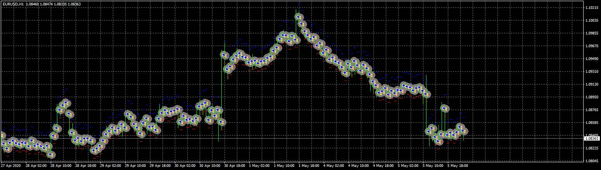

# Simple EA

> Source: https://fxcodebase.com/code/viewtopic.php?f=38&t=69861  
> Forum: 38 · Topic 69861 · 4 post(s)

---

## Simple EA

**Apprentice** · Fri May 15, 2020 7:51 am

Based on request.
[viewtopic.php?f=27&t=69847](https://fxcodebase.com/code/viewtopic.php?f=27&t=69847)

 [Simple EA.mq4](files/133966/Simple%20EA.mq4)

---

## Re: Simple EA

**Eaglesteam** · Tue May 19, 2020 12:21 am

hi, i think you only posted setfiles. The real indicator can not be found

---

## Re: Simple EA

**Apprentice** · Tue May 19, 2020 8:08 am

Your request is added to the development list.
Development reference 1309.

---

## Re: Simple EA

**Apprentice** · Wed May 20, 2020 7:47 am

It's not an indicator. It's an EA.
