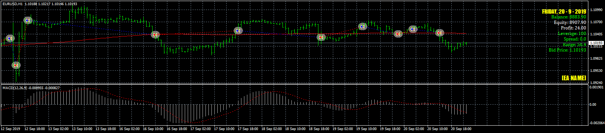
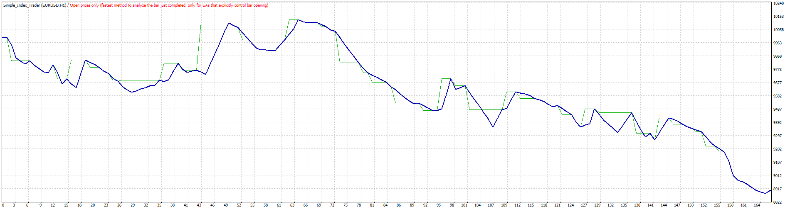

# Simple_Index_Trader EA

> Source: https://fxcodebase.com/code/viewtopic.php?f=38&t=69077  
> Forum: 38 · Topic 69077 · 7 post(s)

---

## Simple_Index_Trader EA

**Apprentice** · Fri Nov 01, 2019 7:20 am

 

Based on request.
[viewtopic.php?f=27&t=69064](https://fxcodebase.com/code/viewtopic.php?f=27&t=69064)

 [Simple_Index_Trader.mq4](files/129516/Simple_Index_Trader.mq4)

---

## Re: Simple_Index_Trader EA

**EZB-Schmarotzer** · Fri Nov 01, 2019 8:14 am

Great work, thank you very much

However, one feature is missing.

I want to exit the Expert Advisor all open positions at a certain time (8 pm GMT).

Can you please add this.

TIA

---

## Re: Simple_Index_Trader EA

**Apprentice** · Sat Nov 02, 2019 8:48 am

Your request is added to the development list.
Development reference 271.

---

## Re: Simple_Index_Trader EA

**Apprentice** · Mon Nov 04, 2019 6:37 am

[Simple_Index_Trader.mq4](files/129542/Simple_Index_Trader.mq4)

Try this version.

---

## Re: Simple_Index_Trader EA

**INNOCENT-S** · Fri Jan 10, 2020 10:41 pm

I try the test of this program but it stops after the opening of the first position. I tried again, it's the same. I do not understand why.

---

## Re: Simple_Index_Trader EA

**Apprentice** · Sat Jan 11, 2020 7:12 am

Your request is added to the development list.
Development reference 539.

---

## Re: Simple_Index_Trader EA

**Apprentice** · Mon Jan 13, 2020 6:23 am

I don't have any issues.
