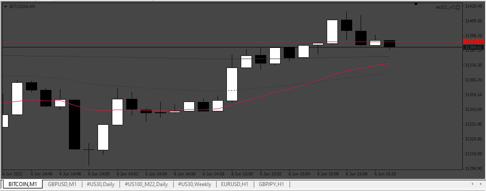
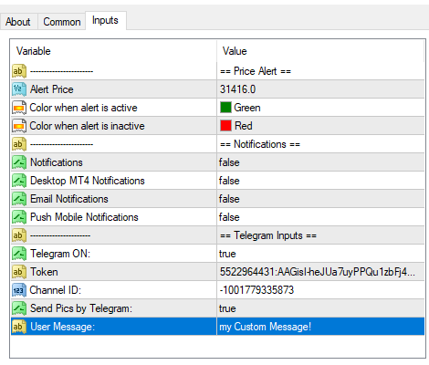
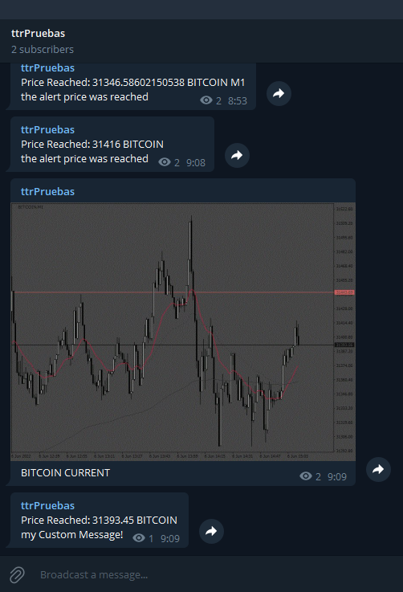

# Simple Price Alert EA

> Source: https://fxcodebase.com/code/viewtopic.php?f=38&t=72343  
> Forum: 38 · Topic 72343 · 4 post(s)

---

## Simple Price Alert EA

**Apprentice** · Mon Jun 06, 2022 9:17 am

 

 

Based on the request.
[https://fxcodebase.com/code/viewtopic.php?f=27&p=146152](https://fxcodebase.com/code/viewtopic.php?f=27&p=146152)

I made an Expert cos the indicators can't send message to telegram, (can't use the function "WebRequest")
Attention:
1. You can change the price alert, directly moving the "Alert Line"
2. The Alert line have NOT to stay selected to the EA send the alert

 [Simple Price Alert EA.mq5](files/146285/Simple%20Price%20Alert%20EA.mq5)

 [Simple Price Alert EA.mq4](files/146285/Simple%20Price%20Alert%20EA.mq4)

---

## Re: Simple Price Alert EA

**foxytrader** · Sun Jun 12, 2022 9:32 pm

Thanks a lot, this is exactly what I am looking for, Can I ask for a Mt4 version as well.

---

## Re: Simple Price Alert EA

**Apprentice** · Wed Jun 15, 2022 1:42 pm

We have added your request to the development list.
Development reference 354.

---

## Re: Simple Price Alert EA

**Apprentice** · Tue Jun 21, 2022 3:19 am

Simple Price Alert EA.mq4 added.
