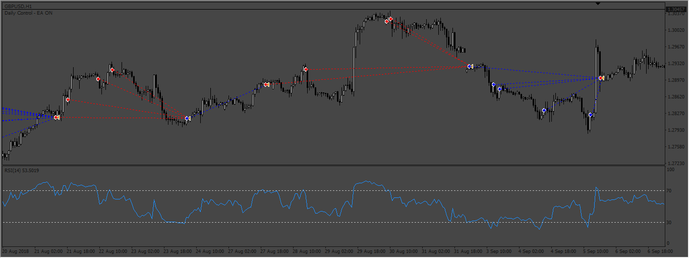
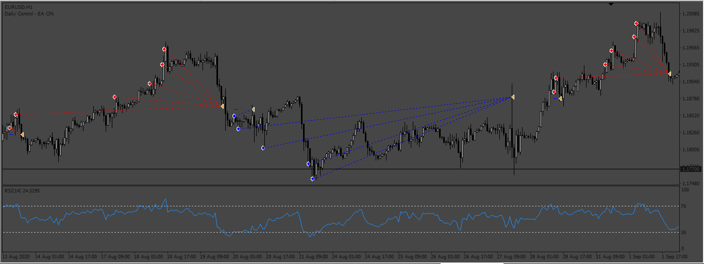

# Simple-Rsi-Crossover EA

> Source: https://fxcodebase.com/code/viewtopic.php?f=38&t=72774  
> Forum: 38 · Topic 72774 · 6 post(s)

---

## Simple-Rsi-Crossover EA

**Apprentice** · Thu Sep 29, 2022 3:27 am

Based on the request.
[https://fxcodebase.com/code/viewtopic.php?f=27&p=147505](https://fxcodebase.com/code/viewtopic.php?f=27&p=147505)

 [Simple-Rsi-Crossover EA.mq4](files/147663/Simple-Rsi-Crossover%20EA.mq4)

 

 [Rsi_Martingale.mq4](files/147663/Rsi_Martingale.mq4)

---

## Re: Simple-Rsi-Crossover EA

**Sensible** · Thu Sep 29, 2022 8:49 am

Thanks FxCodeBase.com for creating this EA for me.

Am so so very much grateful for this wonderful job done.

---

## Re: Simple-Rsi-Crossover EA

**quintana** · Sat Oct 01, 2022 2:50 pm

critical error in the ea

2022.10.01 22:45:24.595	2022.06.16 02:00:00 Simple-Rsi-Crossover EA GBPUSD,H1: invalid pointer access in 'Simple-Rsi-Crossover EA.mq4' (3058,66)

can you take a look thanks

---

## Re: Simple-Rsi-Crossover EA

**Apprentice** · Mon Oct 03, 2022 3:19 am

We have added your request to the development list.
Development reference 605.

---

## Re: Simple-Rsi-Crossover EA

**Apprentice** · Mon Oct 10, 2022 11:58 am

I can't replicate the error, can you send me the setup that you are using?

---

## Re: Simple-Rsi-Crossover EA

**quintana** · Mon Oct 10, 2022 1:30 pm

now it is working properly
thanks
